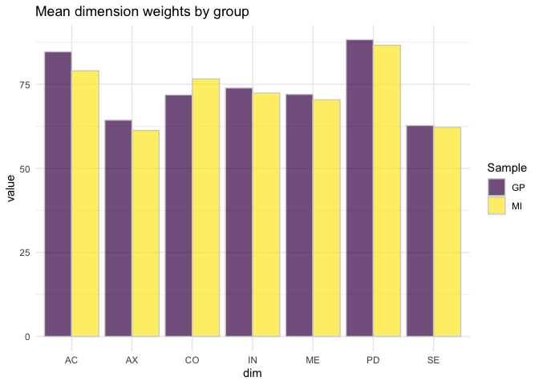

This document contains the data, source code and main results for
**“Developing preference-based value sets for the MobQoL-7D: Practical
application of the Online Elicitation of Personal Utility Functions
(OPUF) tool”** by Nathan Bray, Rhiannon Tudor Edwards, Paul Schneider.

*****

# Setup

    rm(list=ls())

    set.seed(2022)

    library(jsonlite)
    library(ggplot2)
    library(presize)
    library(reshape2)

    library(knitr)

    # load utility functions
    source("./R/mobqol_util.R")

    # define dimension ID
    ds_dims = c("AC","CO","PD","IN","SE","ME","AX")

    # load eligible id 
    eligible_ids_gp = read.csv("./data/gp_anonymised.csv")$id
    eligible_ids_mi = read.csv("./data/mi_anonymised.csv")$id
    # load raw response data
    mq_jsons = read_json("./data/respones_anonymised.json")
    # retrieve and process data from JSON
    # N.B.: eligible ids are provided to exclude respondents who filled in
    # both surveys (i.e. only including them to the one they filled in first)
    gp = retrieveMobQoLPUFs(raw_jsons = mq_jsons, eligible_ids = eligible_ids_gp)
    mi = retrieveMobQoLPUFs(mq_jsons, eligible_ids = eligible_ids_mi)

# Descriptive stats

Number of participants included in the analysis: **504** in the GP
group; and **253** in the MI group.

# demographic characteristics

    # Compare demographic characteristics between GP and MI group
    group_vars = c("gender","age","any_mobility_problems","mobility_problems_meq_6m")
    res_dual = c()
    for(group in group_vars){
      # GP
      t_gp = table(gp$groups_df$value[gp$groups_df$group == group])
      tn_gp = names(t_gp)
      res_gp = paste(t_gp, " (", round(t_gp/length(unique(gp$groups_df$id[gp$groups_df$group == group])),3)*100,"%)", sep ="")
      names(res_gp) = tn_gp
      df_gp = data.frame(var = names(res_gp),value = res_gp)
      
      # MI
      t_mi = table(mi$groups_df$value[mi$groups_df$group == group])
      tn_mi = names(t_mi)
      res_mi = paste(t_mi, " (", round(t_mi/length(unique(mi$groups_df$id[mi$groups_df$group == group])),3)*100,"%)", sep ="")
      names(res_mi) = tn_mi
      df_mi = data.frame(var = names(res_mi),value = res_mi)
      
      df_dual = merge(df_gp, df_mi, by = "var", all = T,suffixes = c("GP","MI"))
      
      row_insert = cbind(group,"","")
      colnames(row_insert) = names(df_dual)
      
      res_dual_group = rbind(row_insert,df_dual)
      res_dual = rbind(res_dual, res_dual_group)
    }
    res_dual[is.na(res_dual)] = ""
    print(kable(res_dual,col.names = c("Group","GP","MI")))

<table>
<thead>
<tr class="header">
<th style="text-align: left;">Group</th>
<th style="text-align: left;">GP</th>
<th style="text-align: left;">MI</th>
</tr>
</thead>
<tbody>
<tr class="odd">
<td style="text-align: left;">gender</td>
<td style="text-align: left;"></td>
<td style="text-align: left;"></td>
</tr>
<tr class="even">
<td style="text-align: left;">female</td>
<td style="text-align: left;">256 (50.8%)</td>
<td style="text-align: left;">118 (46.6%)</td>
</tr>
<tr class="odd">
<td style="text-align: left;">male</td>
<td style="text-align: left;">244 (48.4%)</td>
<td style="text-align: left;">127 (50.2%)</td>
</tr>
<tr class="even">
<td style="text-align: left;">other</td>
<td style="text-align: left;">1 (0.2%)</td>
<td style="text-align: left;">7 (2.8%)</td>
</tr>
<tr class="odd">
<td style="text-align: left;">preferNotToSay</td>
<td style="text-align: left;">3 (0.6%)</td>
<td style="text-align: left;">1 (0.4%)</td>
</tr>
<tr class="even">
<td style="text-align: left;">age</td>
<td style="text-align: left;"></td>
<td style="text-align: left;"></td>
</tr>
<tr class="odd">
<td style="text-align: left;">18-29</td>
<td style="text-align: left;">99 (19.6%)</td>
<td style="text-align: left;">24 (9.5%)</td>
</tr>
<tr class="even">
<td style="text-align: left;">30-39</td>
<td style="text-align: left;">94 (18.7%)</td>
<td style="text-align: left;">49 (19.4%)</td>
</tr>
<tr class="odd">
<td style="text-align: left;">40-49</td>
<td style="text-align: left;">92 (18.3%)</td>
<td style="text-align: left;">47 (18.6%)</td>
</tr>
<tr class="even">
<td style="text-align: left;">50-59</td>
<td style="text-align: left;">103 (20.4%)</td>
<td style="text-align: left;">59 (23.3%)</td>
</tr>
<tr class="odd">
<td style="text-align: left;">60-69</td>
<td style="text-align: left;">95 (18.8%)</td>
<td style="text-align: left;">62 (24.5%)</td>
</tr>
<tr class="even">
<td style="text-align: left;">70+</td>
<td style="text-align: left;">15 (3%)</td>
<td style="text-align: left;">10 (4%)</td>
</tr>
<tr class="odd">
<td style="text-align: left;">preferNotToSay</td>
<td style="text-align: left;">6 (1.2%)</td>
<td style="text-align: left;">2 (0.8%)</td>
</tr>
<tr class="even">
<td style="text-align: left;">any_mobility_problems</td>
<td style="text-align: left;"></td>
<td style="text-align: left;"></td>
</tr>
<tr class="odd">
<td style="text-align: left;">false</td>
<td style="text-align: left;">356 (70.6%)</td>
<td style="text-align: left;"></td>
</tr>
<tr class="even">
<td style="text-align: left;">preferNotToSay</td>
<td style="text-align: left;">16 (3.2%)</td>
<td style="text-align: left;"></td>
</tr>
<tr class="odd">
<td style="text-align: left;">true</td>
<td style="text-align: left;">132 (26.2%)</td>
<td style="text-align: left;">253 (100%)</td>
</tr>
<tr class="even">
<td style="text-align: left;">mobility_problems_meq_6m</td>
<td style="text-align: left;"></td>
<td style="text-align: left;"></td>
</tr>
<tr class="odd">
<td style="text-align: left;">false</td>
<td style="text-align: left;">19 (14.2%)</td>
<td style="text-align: left;"></td>
</tr>
<tr class="even">
<td style="text-align: left;">true</td>
<td style="text-align: left;">115 (85.8%)</td>
<td style="text-align: left;">253 (100%)</td>
</tr>
</tbody>
</table>

# Survey completion times

Mean completion time in the GP group = **9.3 minutes (SD = 6)**

Mean completion time in the MI group = **10.3 minutes (SD = 6)**

    kable(
      cbind(
        cbind(round(summary(round(gp$time_df$seconds/60,1)) ,1)),
        cbind(round(summary(round(mi$time_df$seconds/60,1)) ,1))
      ),
      col.names = c("GP", "MI"),
      caption = "Completion time (mins)"
      )

<table>
<caption>Completion time (mins)</caption>
<thead>
<tr class="header">
<th style="text-align: left;"></th>
<th style="text-align: right;">GP</th>
<th style="text-align: right;">MI</th>
</tr>
</thead>
<tbody>
<tr class="odd">
<td style="text-align: left;">Min.</td>
<td style="text-align: right;">3.0</td>
<td style="text-align: right;">3.6</td>
</tr>
<tr class="even">
<td style="text-align: left;">1st Qu.</td>
<td style="text-align: right;">6.1</td>
<td style="text-align: right;">7.2</td>
</tr>
<tr class="odd">
<td style="text-align: left;">Median</td>
<td style="text-align: right;">8.0</td>
<td style="text-align: right;">9.2</td>
</tr>
<tr class="even">
<td style="text-align: left;">Mean</td>
<td style="text-align: right;">9.3</td>
<td style="text-align: right;">10.3</td>
</tr>
<tr class="odd">
<td style="text-align: left;">3rd Qu.</td>
<td style="text-align: right;">10.4</td>
<td style="text-align: right;">11.6</td>
</tr>
<tr class="even">
<td style="text-align: left;">Max.</td>
<td style="text-align: right;">81.1</td>
<td style="text-align: right;">69.1</td>
</tr>
</tbody>
</table>

Completion time (mins)

# Own health state

    # GP
    fh_str = paste0(sum(gp$own_state_df$state == "1111111"), " (",round(sum(gp$own_state_df$state == "1111111")/gp$n_pufs*100),"%)")
    only_minor = grepl("2",gp$own_state_df$state) &!grepl("3",gp$own_state_df$state) & !grepl("4",gp$own_state_df$state) 
    only_minor_str = paste0(
      sum(only_minor), " (",
      round(sum(only_minor)/gp$n_pufs*100),"%)"
      )
    severe = grepl("4",gp$own_state_df$state) 
    severe_str = paste0(
      sum(severe), " (",
      round(sum(severe)/gp$n_pufs*100),"%)"
      )
    severity_scores = unlist(lapply(strsplit(gp$own_state_df$state,""),\(x)sum(as.numeric(x))))
    severity_scores_str = paste0(round(mean(severity_scores),1), " (", round(sd(severity_scores),1),")")

    gp_hs = c(fh_str,only_minor_str,severe_str,severity_scores_str)

    # MI
    fh_str = paste0(sum(mi$own_state_df$state == "1111111"), " (",round(sum(mi$own_state_df$state == "1111111")/mi$n_pufs*100),"%)")
    only_minor = grepl("2",mi$own_state_df$state) &!grepl("3",mi$own_state_df$state) & !grepl("4",mi$own_state_df$state)
    only_minor_str = paste0(
      sum(only_minor), " (",
      round(sum(only_minor)/mi$n_pufs*100),"%)"
      )
    severe = grepl("4",mi$own_state_df$state)
    severe_str = paste0(
      sum(severe), " (",
      round(sum(severe)/mi$n_pufs*100),"%)"
      )
    severity_scores = unlist(lapply(strsplit(mi$own_state_df$state,""),\(x)sum(as.numeric(x))))
    severity_scores_str = paste0(round(mean(severity_scores),1), " (", round(sd(severity_scores),1),")")
      

    mi_hs = c(fh_str,only_minor_str,severe_str,severity_scores_str)

    hs_dual = cbind(gp_hs,mi_hs)
    rownames(hs_dual) = c("No problems","Only minor","Severe in at least 1","Mean (SD) severity score")
    colnames(hs_dual) = c("GP","MI")

    kable(hs_dual,caption = "Reported health state profiles")

<table>
<caption>Reported health state profiles</caption>
<thead>
<tr class="header">
<th style="text-align: left;"></th>
<th style="text-align: left;">GP</th>
<th style="text-align: left;">MI</th>
</tr>
</thead>
<tbody>
<tr class="odd">
<td style="text-align: left;">No problems</td>
<td style="text-align: left;">238 (47%)</td>
<td style="text-align: left;">0 (0%)</td>
</tr>
<tr class="even">
<td style="text-align: left;">Only minor</td>
<td style="text-align: left;">211 (42%)</td>
<td style="text-align: left;">69 (27%)</td>
</tr>
<tr class="odd">
<td style="text-align: left;">Severe in at least 1</td>
<td style="text-align: left;">11 (2%)</td>
<td style="text-align: left;">72 (28%)</td>
</tr>
<tr class="even">
<td style="text-align: left;">Mean (SD) severity score</td>
<td style="text-align: left;">9.3 (3.2)</td>
<td style="text-align: left;">16.7 (4)</td>
</tr>
</tbody>
</table>

Reported health state profiles

N.B. Minimum severity score = 7

# OPUF responses

# Dimension weights

    # GP
    dim_weights_gp = by(gp$weights_df$value, gp$weights_df$dim_id, \(dim){
          paste(round(mean(dim),1), " (",round(sd(dim),1),")",sep = "")
    })
    dim_ranks_gp = rank(-by(gp$weights_df$value, gp$weights_df$dim_id, mean))
    # MI
    dim_weights_mi = by(mi$weights_df$value, mi$weights_df$dim_id, \(dim){
        paste(round(mean(dim),1), " (",round(sd(dim),1),")",sep = "")
    })
    dim_ranks_mi = rank(-by(mi$weights_df$value, mi$weights_df$dim_id, mean))
    # combined
    dim_weights_tbl = cbind(dim_weights_gp,dim_ranks_gp,dim_weights_mi,dim_ranks_mi)
    rownames(dim_weights_tbl) = names(dim_weights_gp)
    kable(dim_weights_tbl, col.names = c("GP Mean (SD)","GP Rank","MI Mean (SD)","MI Rank"))

<table>
<thead>
<tr class="header">
<th style="text-align: left;"></th>
<th style="text-align: left;">GP Mean (SD)</th>
<th style="text-align: left;">GP Rank</th>
<th style="text-align: left;">MI Mean (SD)</th>
<th style="text-align: left;">MI Rank</th>
</tr>
</thead>
<tbody>
<tr class="odd">
<td style="text-align: left;">AC</td>
<td style="text-align: left;">84.7 (23.1)</td>
<td style="text-align: left;">2</td>
<td style="text-align: left;">79 (26.5)</td>
<td style="text-align: left;">2</td>
</tr>
<tr class="even">
<td style="text-align: left;">AX</td>
<td style="text-align: left;">64.3 (30.9)</td>
<td style="text-align: left;">6</td>
<td style="text-align: left;">61.3 (31.6)</td>
<td style="text-align: left;">7</td>
</tr>
<tr class="odd">
<td style="text-align: left;">CO</td>
<td style="text-align: left;">71.9 (27.2)</td>
<td style="text-align: left;">5</td>
<td style="text-align: left;">76.6 (26.7)</td>
<td style="text-align: left;">3</td>
</tr>
<tr class="even">
<td style="text-align: left;">IN</td>
<td style="text-align: left;">73.9 (26.8)</td>
<td style="text-align: left;">3</td>
<td style="text-align: left;">72.4 (27.7)</td>
<td style="text-align: left;">4</td>
</tr>
<tr class="odd">
<td style="text-align: left;">ME</td>
<td style="text-align: left;">72 (28.2)</td>
<td style="text-align: left;">4</td>
<td style="text-align: left;">70.4 (28.7)</td>
<td style="text-align: left;">5</td>
</tr>
<tr class="even">
<td style="text-align: left;">PD</td>
<td style="text-align: left;">88.3 (20.3)</td>
<td style="text-align: left;">1</td>
<td style="text-align: left;">86.6 (22.7)</td>
<td style="text-align: left;">1</td>
</tr>
<tr class="odd">
<td style="text-align: left;">SE</td>
<td style="text-align: left;">62.7 (31.2)</td>
<td style="text-align: left;">7</td>
<td style="text-align: left;">62.2 (29.8)</td>
<td style="text-align: left;">6</td>
</tr>
</tbody>
</table>

    dim_weights_gp = by(gp$weights_df$value, gp$weights_df$dim_id, mean)
    dim_weights_mi = by(mi$weights_df$value, mi$weights_df$dim_id, mean)

    weights_df = data.frame(
      group = c(rep("GP",7),rep("MI",7)),
      dim = names(dim_weights_gp),
      value = c(dim_weights_gp,dim_weights_mi)
    )

    ggplot(weights_df, aes(fill=group, y=value, x=dim)) + 
        geom_bar(position="dodge", stat="identity", alpha = 0.7, color = "lightgray") +
      theme_minimal() +
      scale_fill_viridis_d(name = "Sample") +
      # theme(legend.position = "none") +
      ggtitle("Mean dimension weights by group")

# Level ratings

    lvl_ratings_gp = lapply(ds_dims,\(dim){
        s_ = grepl(dim,gp$ratings_df$lvl_id) & !grepl("_3",gp$ratings_df$lvl_id) & !grepl("_0",gp$ratings_df$lvl_id)
        df_ = gp$ratings_df[s_,]
        x = by(df_$value,df_$lvl_id,\(lvl){
            paste(round(mean(lvl),1), " (",round(sd(lvl),1),")",sep = "")
        })
        x = rbind(c(""),matrix(x))
        rownames(x) = c(dim,"lvl2","lvl3")
        x
      })
    lvl_ratings_mi = lapply(ds_dims,\(dim){
        s_ = grepl(dim,mi$ratings_df$lvl_id) & !grepl("_3",mi$ratings_df$lvl_id) & !grepl("_0",mi$ratings_df$lvl_id)
        df_ = mi$ratings_df[s_,]
        x = by(df_$value,df_$lvl_id,\(lvl){
            paste(round(mean(lvl),1), " (",round(sd(lvl),1),")",sep = "")
        })
        x = rbind(c(""),matrix(x))
        rownames(x) = c(dim,"lvl2","lvl3")
        x
      })

    lvl_ratings_tbl_gp = do.call(rbind, lvl_ratings_gp)
    lvl_ratings_tbl_mi = do.call(rbind, lvl_ratings_mi)
    lvl_ratings_tbl_dual = cbind(lvl_ratings_tbl_gp, lvl_ratings_tbl_mi)
    kable(lvl_ratings_tbl_dual, col.names = c("GP Mean (SD)","MI Mean (SD)"))

<table>
<thead>
<tr class="header">
<th style="text-align: left;"></th>
<th style="text-align: left;">GP Mean (SD)</th>
<th style="text-align: left;">MI Mean (SD)</th>
</tr>
</thead>
<tbody>
<tr class="odd">
<td style="text-align: left;">AC</td>
<td style="text-align: left;"></td>
<td style="text-align: left;"></td>
</tr>
<tr class="even">
<td style="text-align: left;">lvl2</td>
<td style="text-align: left;">57.1 (24.9)</td>
<td style="text-align: left;">55.2 (24.3)</td>
</tr>
<tr class="odd">
<td style="text-align: left;">lvl3</td>
<td style="text-align: left;">29.6 (26.5)</td>
<td style="text-align: left;">32.6 (26.8)</td>
</tr>
<tr class="even">
<td style="text-align: left;">CO</td>
<td style="text-align: left;"></td>
<td style="text-align: left;"></td>
</tr>
<tr class="odd">
<td style="text-align: left;">lvl2</td>
<td style="text-align: left;">55.2 (22.3)</td>
<td style="text-align: left;">53.5 (21.4)</td>
</tr>
<tr class="even">
<td style="text-align: left;">lvl3</td>
<td style="text-align: left;">32.9 (22.9)</td>
<td style="text-align: left;">34.8 (22.9)</td>
</tr>
<tr class="odd">
<td style="text-align: left;">PD</td>
<td style="text-align: left;"></td>
<td style="text-align: left;"></td>
</tr>
<tr class="even">
<td style="text-align: left;">lvl2</td>
<td style="text-align: left;">57.5 (24.8)</td>
<td style="text-align: left;">56.7 (24.1)</td>
</tr>
<tr class="odd">
<td style="text-align: left;">lvl3</td>
<td style="text-align: left;">30.9 (28.2)</td>
<td style="text-align: left;">32 (27)</td>
</tr>
<tr class="even">
<td style="text-align: left;">IN</td>
<td style="text-align: left;"></td>
<td style="text-align: left;"></td>
</tr>
<tr class="odd">
<td style="text-align: left;">lvl2</td>
<td style="text-align: left;">72.9 (18.7)</td>
<td style="text-align: left;">61.9 (26.8)</td>
</tr>
<tr class="even">
<td style="text-align: left;">lvl3</td>
<td style="text-align: left;">43.9 (20)</td>
<td style="text-align: left;">41.6 (19)</td>
</tr>
<tr class="odd">
<td style="text-align: left;">SE</td>
<td style="text-align: left;"></td>
<td style="text-align: left;"></td>
</tr>
<tr class="even">
<td style="text-align: left;">lvl2</td>
<td style="text-align: left;">53 (24.5)</td>
<td style="text-align: left;">53.6 (22)</td>
</tr>
<tr class="odd">
<td style="text-align: left;">lvl3</td>
<td style="text-align: left;">32.9 (24.2)</td>
<td style="text-align: left;">35.2 (24.9)</td>
</tr>
<tr class="even">
<td style="text-align: left;">ME</td>
<td style="text-align: left;"></td>
<td style="text-align: left;"></td>
</tr>
<tr class="odd">
<td style="text-align: left;">lvl2</td>
<td style="text-align: left;">52.9 (22.8)</td>
<td style="text-align: left;">54.1 (21.8)</td>
</tr>
<tr class="even">
<td style="text-align: left;">lvl3</td>
<td style="text-align: left;">32 (23.2)</td>
<td style="text-align: left;">34.2 (24.6)</td>
</tr>
<tr class="odd">
<td style="text-align: left;">AX</td>
<td style="text-align: left;"></td>
<td style="text-align: left;"></td>
</tr>
<tr class="even">
<td style="text-align: left;">lvl2</td>
<td style="text-align: left;">55.5 (26)</td>
<td style="text-align: left;">54.4 (24.8)</td>
</tr>
<tr class="odd">
<td style="text-align: left;">lvl3</td>
<td style="text-align: left;">29 (24.2)</td>
<td style="text-align: left;">32.2 (25.3)</td>
</tr>
</tbody>
</table>

# Anchoring

In the **GP** group, **331 (66%)** Participants indicated they would
prefer the worst state over being dead. Correspondingly, **173 (34%)**
Participants indicated they would prefer being dead over the worst state
or be indifferent.

In the **MI** group, **181 (72%)** Participants indicated they would
prefer the worst state over being dead. Correspondingly, **72 (28%)**
Participants indicated they would prefer being dead over the worst state
or be indifferent.

    # GP 
    # 'extreme preferences':
    # sum(gp$anchor_df$anchor> 2) # n participants
    # round(sum(gp$anchor_df$anchor> 2)/gp$n_pufs*100) # %
    # Thus: trim anchor points to -1 (this is commonly done)
    gp_trimmed = gp$anchor_df$anchor
    gp_trimmed[gp_trimmed> 2] = 2
    # with and without the outliers, new mean anchor point is different:
    # 1-mean(gp_trimmed);sd(gp_trimmed);

    # MI
    # 'extreme preferences':
    # sum(mi$anchor_df$anchor> 2) # n participants
    # round(sum(mi$anchor_df$anchor> 2)/mi$n_pufs*100) # %
    mi_trimmed = mi$anchor_df$anchor
    mi_trimmed[mi_trimmed> 2] = 2

    # distribution of achor points
    ggplot() +
      geom_vline(xintercept = 0, linetype = "dashed") +
      geom_density(aes(1-gp_trimmed, fill = "GP"), col = "black", alpha = 0.5) +
      geom_density(aes(1-mi_trimmed, fill = "MI"), col = "black", alpha = 0.4) +
      scale_fill_viridis_d(name  = "Sample") +
      xlab("Density - distribution of utility values for the worst state") +
      theme_minimal()

After capping utlity scale at -1 (which is commonly done), the mean (SD)
anchor point (i.e. the utility of the worst health state) was **0.171
(0.472)** in the GP group, and **0.242 (0.47)** in the MI group.

N.B. In the GP group, 29 (6 %) participants had anchor points below -1.
In the MI group, there were 14 (6 %) participants who had such low
anchor points.

# MobQol value sets

    # Social preference model
    # GP
    gp_mean_est = formatC(apply(gp$pufs_trimmed,2,mean),digits = 3, format = "f")
    gp_mean_boot = replicate(10000,apply(gp$pufs_trimmed[sample(1:nrow(gp$pufs_trimmed),size = nrow(gp$pufs_trimmed),replace = T),],2,mean))
    gp_mean_boot = formatC(apply(gp_mean_boot,1,quantile,probs = c(0.025,0.975)),digits = 3, format = "f")
    gp_m_95 = sapply(1:ncol(gp_mean_boot), \(i) paste(gp_mean_est[i]," (",gp_mean_boot[1,i],"; ",gp_mean_boot[2,i],")",sep = ""))

    # MI
    mi_mean_est = formatC(apply(mi$pufs_trimmed,2,mean),digits = 3, format = "f")
    mi_mean_boot = replicate(10000,apply(mi$pufs_trimmed[sample(1:nrow(mi$pufs_trimmed),size = nrow(mi$pufs_trimmed),replace = T),],2,mean))
    mi_mean_boot = formatC(apply(mi_mean_boot,1,quantile,probs = c(0.025,0.975)),digits = 3, format = "f")
    mi_m_95 = sapply(1:ncol(mi_mean_boot), \(i) paste(mi_mean_est[i]," (",mi_mean_boot[1,i],"; ",mi_mean_boot[2,i],")",sep = ""))

    # Dual
    dual_m_95 = cbind(gp_m_95,mi_m_95)
    rownames(dual_m_95) = paste0(rep(ds_dims, each = 4),"_",1:4)
    kable(
      dual_m_95, 
      col.names = c("GP","MI"),
      caption = "Social (GP) and MI-based value set for the MobQoL - mean and 95%CI"
      )

<table>
<caption>Social (GP) and MI-based value set for the MobQoL - mean and
95%CI</caption>
<thead>
<tr class="header">
<th style="text-align: left;"></th>
<th style="text-align: left;">GP</th>
<th style="text-align: left;">MI</th>
</tr>
</thead>
<tbody>
<tr class="odd">
<td style="text-align: left;">AC_1</td>
<td style="text-align: left;">0.000 (0.000; 0.000)</td>
<td style="text-align: left;">0.000 (0.000; 0.000)</td>
</tr>
<tr class="even">
<td style="text-align: left;">AC_2</td>
<td style="text-align: left;">0.063 (0.057; 0.070)</td>
<td style="text-align: left;">0.056 (0.049; 0.065)</td>
</tr>
<tr class="odd">
<td style="text-align: left;">AC_3</td>
<td style="text-align: left;">0.106 (0.098; 0.116)</td>
<td style="text-align: left;">0.085 (0.076; 0.094)</td>
</tr>
<tr class="even">
<td style="text-align: left;">AC_4</td>
<td style="text-align: left;">0.148 (0.138; 0.158)</td>
<td style="text-align: left;">0.128 (0.115; 0.142)</td>
</tr>
<tr class="odd">
<td style="text-align: left;">CO_1</td>
<td style="text-align: left;">0.000 (0.000; 0.000)</td>
<td style="text-align: left;">0.000 (0.000; 0.000)</td>
</tr>
<tr class="even">
<td style="text-align: left;">CO_2</td>
<td style="text-align: left;">0.054 (0.049; 0.059)</td>
<td style="text-align: left;">0.055 (0.049; 0.063)</td>
</tr>
<tr class="odd">
<td style="text-align: left;">CO_3</td>
<td style="text-align: left;">0.082 (0.075; 0.089)</td>
<td style="text-align: left;">0.082 (0.073; 0.093)</td>
</tr>
<tr class="even">
<td style="text-align: left;">CO_4</td>
<td style="text-align: left;">0.121 (0.112; 0.130)</td>
<td style="text-align: left;">0.123 (0.110; 0.138)</td>
</tr>
<tr class="odd">
<td style="text-align: left;">PD_1</td>
<td style="text-align: left;">0.000 (0.000; 0.000)</td>
<td style="text-align: left;">0.000 (0.000; 0.000)</td>
</tr>
<tr class="even">
<td style="text-align: left;">PD_2</td>
<td style="text-align: left;">0.068 (0.061; 0.076)</td>
<td style="text-align: left;">0.061 (0.052; 0.070)</td>
</tr>
<tr class="odd">
<td style="text-align: left;">PD_3</td>
<td style="text-align: left;">0.111 (0.102; 0.122)</td>
<td style="text-align: left;">0.099 (0.088; 0.111)</td>
</tr>
<tr class="even">
<td style="text-align: left;">PD_4</td>
<td style="text-align: left;">0.160 (0.148; 0.173)</td>
<td style="text-align: left;">0.139 (0.126; 0.154)</td>
</tr>
<tr class="odd">
<td style="text-align: left;">IN_1</td>
<td style="text-align: left;">0.000 (0.000; 0.000)</td>
<td style="text-align: left;">0.000 (0.000; 0.000)</td>
</tr>
<tr class="even">
<td style="text-align: left;">IN_2</td>
<td style="text-align: left;">0.033 (0.030; 0.037)</td>
<td style="text-align: left;">0.038 (0.033; 0.044)</td>
</tr>
<tr class="odd">
<td style="text-align: left;">IN_3</td>
<td style="text-align: left;">0.072 (0.066; 0.078)</td>
<td style="text-align: left;">0.064 (0.057; 0.071)</td>
</tr>
<tr class="even">
<td style="text-align: left;">IN_4</td>
<td style="text-align: left;">0.124 (0.115; 0.133)</td>
<td style="text-align: left;">0.108 (0.098; 0.119)</td>
</tr>
<tr class="odd">
<td style="text-align: left;">SE_1</td>
<td style="text-align: left;">0.000 (0.000; 0.000)</td>
<td style="text-align: left;">0.000 (0.000; 0.000)</td>
</tr>
<tr class="even">
<td style="text-align: left;">SE_2</td>
<td style="text-align: left;">0.046 (0.042; 0.050)</td>
<td style="text-align: left;">0.045 (0.039; 0.052)</td>
</tr>
<tr class="odd">
<td style="text-align: left;">SE_3</td>
<td style="text-align: left;">0.068 (0.063; 0.075)</td>
<td style="text-align: left;">0.063 (0.056; 0.072)</td>
</tr>
<tr class="even">
<td style="text-align: left;">SE_4</td>
<td style="text-align: left;">0.098 (0.091; 0.105)</td>
<td style="text-align: left;">0.098 (0.087; 0.109)</td>
</tr>
<tr class="odd">
<td style="text-align: left;">ME_1</td>
<td style="text-align: left;">0.000 (0.000; 0.000)</td>
<td style="text-align: left;">0.000 (0.000; 0.000)</td>
</tr>
<tr class="even">
<td style="text-align: left;">ME_2</td>
<td style="text-align: left;">0.055 (0.050; 0.061)</td>
<td style="text-align: left;">0.050 (0.043; 0.057)</td>
</tr>
<tr class="odd">
<td style="text-align: left;">ME_3</td>
<td style="text-align: left;">0.084 (0.077; 0.093)</td>
<td style="text-align: left;">0.070 (0.063; 0.078)</td>
</tr>
<tr class="even">
<td style="text-align: left;">ME_4</td>
<td style="text-align: left;">0.119 (0.110; 0.130)</td>
<td style="text-align: left;">0.110 (0.098; 0.123)</td>
</tr>
<tr class="odd">
<td style="text-align: left;">AX_1</td>
<td style="text-align: left;">0.000 (0.000; 0.000)</td>
<td style="text-align: left;">0.000 (0.000; 0.000)</td>
</tr>
<tr class="even">
<td style="text-align: left;">AX_2</td>
<td style="text-align: left;">0.044 (0.040; 0.049)</td>
<td style="text-align: left;">0.042 (0.036; 0.048)</td>
</tr>
<tr class="odd">
<td style="text-align: left;">AX_3</td>
<td style="text-align: left;">0.073 (0.067; 0.079)</td>
<td style="text-align: left;">0.064 (0.056; 0.072)</td>
</tr>
<tr class="even">
<td style="text-align: left;">AX_4</td>
<td style="text-align: left;">0.101 (0.094; 0.109)</td>
<td style="text-align: left;">0.093 (0.083; 0.105)</td>
</tr>
</tbody>
</table>

Social (GP) and MI-based value set for the MobQoL - mean and 95%CI

# Value sets separately

## GP

    kable(matrix(
      gp_m_95,
      ncol = 7,
      dimnames = list(paste0("lvl_", 1:4), ds_dims)
    ),
    caption = "GP",
    align = "c")

<table>
<caption>GP</caption>
<colgroup>
<col style="width: 3%" />
<col style="width: 13%" />
<col style="width: 13%" />
<col style="width: 13%" />
<col style="width: 13%" />
<col style="width: 13%" />
<col style="width: 13%" />
<col style="width: 13%" />
</colgroup>
<thead>
<tr class="header">
<th style="text-align: left;"></th>
<th style="text-align: center;">AC</th>
<th style="text-align: center;">CO</th>
<th style="text-align: center;">PD</th>
<th style="text-align: center;">IN</th>
<th style="text-align: center;">SE</th>
<th style="text-align: center;">ME</th>
<th style="text-align: center;">AX</th>
</tr>
</thead>
<tbody>
<tr class="odd">
<td style="text-align: left;">lvl_1</td>
<td style="text-align: center;">0.000 (0.000; 0.000)</td>
<td style="text-align: center;">0.000 (0.000; 0.000)</td>
<td style="text-align: center;">0.000 (0.000; 0.000)</td>
<td style="text-align: center;">0.000 (0.000; 0.000)</td>
<td style="text-align: center;">0.000 (0.000; 0.000)</td>
<td style="text-align: center;">0.000 (0.000; 0.000)</td>
<td style="text-align: center;">0.000 (0.000; 0.000)</td>
</tr>
<tr class="even">
<td style="text-align: left;">lvl_2</td>
<td style="text-align: center;">0.063 (0.057; 0.070)</td>
<td style="text-align: center;">0.054 (0.049; 0.059)</td>
<td style="text-align: center;">0.068 (0.061; 0.076)</td>
<td style="text-align: center;">0.033 (0.030; 0.037)</td>
<td style="text-align: center;">0.046 (0.042; 0.050)</td>
<td style="text-align: center;">0.055 (0.050; 0.061)</td>
<td style="text-align: center;">0.044 (0.040; 0.049)</td>
</tr>
<tr class="odd">
<td style="text-align: left;">lvl_3</td>
<td style="text-align: center;">0.106 (0.098; 0.116)</td>
<td style="text-align: center;">0.082 (0.075; 0.089)</td>
<td style="text-align: center;">0.111 (0.102; 0.122)</td>
<td style="text-align: center;">0.072 (0.066; 0.078)</td>
<td style="text-align: center;">0.068 (0.063; 0.075)</td>
<td style="text-align: center;">0.084 (0.077; 0.093)</td>
<td style="text-align: center;">0.073 (0.067; 0.079)</td>
</tr>
<tr class="even">
<td style="text-align: left;">lvl_4</td>
<td style="text-align: center;">0.148 (0.138; 0.158)</td>
<td style="text-align: center;">0.121 (0.112; 0.130)</td>
<td style="text-align: center;">0.160 (0.148; 0.173)</td>
<td style="text-align: center;">0.124 (0.115; 0.133)</td>
<td style="text-align: center;">0.098 (0.091; 0.105)</td>
<td style="text-align: center;">0.119 (0.110; 0.130)</td>
<td style="text-align: center;">0.101 (0.094; 0.109)</td>
</tr>
</tbody>
</table>

GP

## MI

    kable(matrix(
      mi_m_95,
      ncol = 7,
      dimnames = list(paste0("lvl_", 1:4), ds_dims)
    ),
    caption = "MI",
    align = "c")

<table>
<caption>MI</caption>
<colgroup>
<col style="width: 3%" />
<col style="width: 13%" />
<col style="width: 13%" />
<col style="width: 13%" />
<col style="width: 13%" />
<col style="width: 13%" />
<col style="width: 13%" />
<col style="width: 13%" />
</colgroup>
<thead>
<tr class="header">
<th style="text-align: left;"></th>
<th style="text-align: center;">AC</th>
<th style="text-align: center;">CO</th>
<th style="text-align: center;">PD</th>
<th style="text-align: center;">IN</th>
<th style="text-align: center;">SE</th>
<th style="text-align: center;">ME</th>
<th style="text-align: center;">AX</th>
</tr>
</thead>
<tbody>
<tr class="odd">
<td style="text-align: left;">lvl_1</td>
<td style="text-align: center;">0.000 (0.000; 0.000)</td>
<td style="text-align: center;">0.000 (0.000; 0.000)</td>
<td style="text-align: center;">0.000 (0.000; 0.000)</td>
<td style="text-align: center;">0.000 (0.000; 0.000)</td>
<td style="text-align: center;">0.000 (0.000; 0.000)</td>
<td style="text-align: center;">0.000 (0.000; 0.000)</td>
<td style="text-align: center;">0.000 (0.000; 0.000)</td>
</tr>
<tr class="even">
<td style="text-align: left;">lvl_2</td>
<td style="text-align: center;">0.056 (0.049; 0.065)</td>
<td style="text-align: center;">0.055 (0.049; 0.063)</td>
<td style="text-align: center;">0.061 (0.052; 0.070)</td>
<td style="text-align: center;">0.038 (0.033; 0.044)</td>
<td style="text-align: center;">0.045 (0.039; 0.052)</td>
<td style="text-align: center;">0.050 (0.043; 0.057)</td>
<td style="text-align: center;">0.042 (0.036; 0.048)</td>
</tr>
<tr class="odd">
<td style="text-align: left;">lvl_3</td>
<td style="text-align: center;">0.085 (0.076; 0.094)</td>
<td style="text-align: center;">0.082 (0.073; 0.093)</td>
<td style="text-align: center;">0.099 (0.088; 0.111)</td>
<td style="text-align: center;">0.064 (0.057; 0.071)</td>
<td style="text-align: center;">0.063 (0.056; 0.072)</td>
<td style="text-align: center;">0.070 (0.063; 0.078)</td>
<td style="text-align: center;">0.064 (0.056; 0.072)</td>
</tr>
<tr class="even">
<td style="text-align: left;">lvl_4</td>
<td style="text-align: center;">0.128 (0.115; 0.142)</td>
<td style="text-align: center;">0.123 (0.110; 0.138)</td>
<td style="text-align: center;">0.139 (0.126; 0.154)</td>
<td style="text-align: center;">0.108 (0.098; 0.119)</td>
<td style="text-align: center;">0.098 (0.087; 0.109)</td>
<td style="text-align: center;">0.110 (0.098; 0.123)</td>
<td style="text-align: center;">0.093 (0.083; 0.105)</td>
</tr>
</tbody>
</table>

MI

# Value set difference

    # mean difference
    m_diff = apply(gp$pufs_trimmed,2,mean) - apply(mi$pufs_trimmed,2,mean)
    m_diff_str = formatC(m_diff,digits = 3, format = "f")

    # bootstrapped 95% conf ints
    boots = 10000
    s_gp = replicate(boots, sample(1:nrow(gp$pufs_trimmed),replace = T))
    s_mi = replicate(boots, sample(1:nrow(mi$pufs_trimmed),replace = T))
    res = matrix(data = NA,ncol = ncol(mi$pufs_trimmed), nrow=boots )
    for(i in 1:boots){
      s_gp_i = s_gp[,i]
      m_gp = apply(gp$pufs_trimmed[s_gp_i,],2,mean)
      
      s_mi_i = s_mi[,i]
      m_mi = apply(mi$pufs_trimmed[s_mi_i,],2,mean)
      
      res[i,] = m_gp - m_mi
      
    }

    res_str = apply(res,2,\(x){
      ci95 = quantile(x,c(0.025,0.975))
      ci95_str = formatC(ci95,digits = 3, format = "f")
      return(ci95_str)
    })

    res_str_mat = paste0(m_diff_str, " (",res_str[1,],"; ",res_str[2,],")")

    kable(
      matrix(
        data = res_str_mat, 
        ncol = 7, 
        dimnames = list(paste0("lvl_",1:4),ds_dims)
        ), 
      caption = "GP - MI difference",
      align = "c"
      )

<table>
<caption>GP - MI difference</caption>
<colgroup>
<col style="width: 3%" />
<col style="width: 13%" />
<col style="width: 14%" />
<col style="width: 13%" />
<col style="width: 14%" />
<col style="width: 13%" />
<col style="width: 13%" />
<col style="width: 13%" />
</colgroup>
<thead>
<tr class="header">
<th style="text-align: left;"></th>
<th style="text-align: center;">AC</th>
<th style="text-align: center;">CO</th>
<th style="text-align: center;">PD</th>
<th style="text-align: center;">IN</th>
<th style="text-align: center;">SE</th>
<th style="text-align: center;">ME</th>
<th style="text-align: center;">AX</th>
</tr>
</thead>
<tbody>
<tr class="odd">
<td style="text-align: left;">lvl_1</td>
<td style="text-align: center;">0.000 (0.000; 0.000)</td>
<td style="text-align: center;">0.000 (0.000; 0.000)</td>
<td style="text-align: center;">0.000 (0.000; 0.000)</td>
<td style="text-align: center;">0.000 (0.000; 0.000)</td>
<td style="text-align: center;">0.000 (0.000; 0.000)</td>
<td style="text-align: center;">0.000 (0.000; 0.000)</td>
<td style="text-align: center;">0.000 (0.000; 0.000)</td>
</tr>
<tr class="even">
<td style="text-align: left;">lvl_2</td>
<td style="text-align: center;">0.007 (-0.004; 0.017)</td>
<td style="text-align: center;">-0.001 (-0.010; 0.007)</td>
<td style="text-align: center;">0.007 (-0.005; 0.019)</td>
<td style="text-align: center;">-0.005 (-0.012; 0.001)</td>
<td style="text-align: center;">0.001 (-0.008; 0.008)</td>
<td style="text-align: center;">0.005 (-0.003; 0.014)</td>
<td style="text-align: center;">0.003 (-0.005; 0.010)</td>
</tr>
<tr class="odd">
<td style="text-align: left;">lvl_3</td>
<td style="text-align: center;">0.021 (0.009; 0.034)</td>
<td style="text-align: center;">-0.000 (-0.013; 0.012)</td>
<td style="text-align: center;">0.012 (-0.003; 0.027)</td>
<td style="text-align: center;">0.008 (-0.001; 0.017)</td>
<td style="text-align: center;">0.005 (-0.005; 0.015)</td>
<td style="text-align: center;">0.014 (0.003; 0.025)</td>
<td style="text-align: center;">0.009 (-0.001; 0.019)</td>
</tr>
<tr class="even">
<td style="text-align: left;">lvl_4</td>
<td style="text-align: center;">0.020 (0.003; 0.037)</td>
<td style="text-align: center;">-0.002 (-0.019; 0.014)</td>
<td style="text-align: center;">0.021 (0.002; 0.040)</td>
<td style="text-align: center;">0.016 (0.002; 0.030)</td>
<td style="text-align: center;">0.001 (-0.013; 0.014)</td>
<td style="text-align: center;">0.009 (-0.007; 0.025)</td>
<td style="text-align: center;">0.008 (-0.006; 0.020)</td>
</tr>
</tbody>
</table>

GP - MI difference

    # social value set
    social_model = matrix(apply(gp$pufs_trimmed,2,mean), ncol = length(ds_dims))
    ds_expanded = expand.grid(lapply(1:7, \(x) 1:4))
    ds_str = apply(ds_expanded,1,\(x) paste0(x,collapse=""))
    gp_vs = c()
    for(i in 1:nrow(ds_expanded)){
      v_ = 1
      for(j in seq_along(ds_expanded[i,])){
        v_ = v_ - social_model[ds_expanded[i,j],j]
      }
      gp_vs = c(gp_vs, v_)
    }

    gp_hs_ranking = rank(-gp_vs)

    mi_model = matrix(apply(mi$pufs_trimmed,2,mean), ncol = length(ds_dims))
    mi_vs = c()
    for(i in 1:nrow(ds_expanded)){
      v_ = 1
      for(j in seq_along(ds_expanded[i,])){
        v_ = v_ - mi_model[ds_expanded[i,j],j]
      }
      mi_vs = c(mi_vs, v_)
    }

    mi_hs_ranking = rank(-mi_vs)

    dual_vs = data.frame(
      state = ds_str,
      gp = gp_vs,
      gp_vs_rank = gp_hs_ranking,
      mi = mi_vs,
      mi_rank = mi_hs_ranking
    )
    dual_vs$util_diff = dual_vs$gp - dual_vs$mi
    dual_vs$rank_diff = dual_vs$gp_vs_rank - dual_vs$mi_rank
    write.csv(dual_vs, file = "./output/dual_vs.csv")
    # (see sample health state values below and full results in separate file 'output/dual_vs.csv')

# Number of states worse than dead?

Neither in the GP nor in the MI group is the utility value of any states
negative. On average, both groups consider all health state better than
dead.

# Value set visualisation

    ggplot() +
      geom_hline(yintercept = 0, col = "gray", size = 0.5) +
      # geom_line(aes(x = 1:length(gp_hs_ranking), y = gp_vs[gp_hs_ranking])) +
      geom_line(data = dual_vs, aes(x=gp_vs_rank, y = gp, col = "GP"), size = 0.8, alpha =.7) +
      geom_line(data = dual_vs, aes(x=gp_vs_rank, y = mi, col = "MI"), size = 0.5, alpha =.7) +
      scale_color_viridis_d(name = "Sample") +
      ylab("HRQoL / Utility") +
      xlab("MobQoL states - ranked from best to worst") +
      theme_minimal()

# Distribution of utility values

      ggplot() +
      geom_histogram(data = dual_vs, aes(gp, fill = "GP"),color="darkgray", size = 0.8, alpha =.9, binwidth = 0.01) +
      geom_histogram(data = dual_vs, aes(mi, fill = "MI"),color="gray", size = 0.8, alpha =.6,binwidth = 0.01) +
      scale_fill_viridis_d(name = "Sample") +
      ylab("Frequency") +
      xlab("HRQoL / Utility") +
      theme_minimal()

# Value set table - GP vs MI, top and bottom 100 states (of all 16,384 states)

    dual_vs = dual_vs[order(dual_vs$gp_vs_rank),]
    kable(
      rbind(head(dual_vs, 100),tail(dual_vs, 100)), 
      col.names = c("Health state","GP utility","GP rank","MI utility", "MI rank","Util diff","Rank diff"),
      caption = "GP vs MI value sets",
      row.names = F
      )

<table style="width:100%;">
<caption>GP vs MI value sets</caption>
<colgroup>
<col style="width: 18%" />
<col style="width: 15%" />
<col style="width: 11%" />
<col style="width: 15%" />
<col style="width: 11%" />
<col style="width: 15%" />
<col style="width: 13%" />
</colgroup>
<thead>
<tr class="header">
<th style="text-align: left;">Health state</th>
<th style="text-align: right;">GP utility</th>
<th style="text-align: right;">GP rank</th>
<th style="text-align: right;">MI utility</th>
<th style="text-align: right;">MI rank</th>
<th style="text-align: right;">Util diff</th>
<th style="text-align: right;">Rank diff</th>
</tr>
</thead>
<tbody>
<tr class="odd">
<td style="text-align: left;">1111111</td>
<td style="text-align: right;">1.0000000</td>
<td style="text-align: right;">1</td>
<td style="text-align: right;">1.0000000</td>
<td style="text-align: right;">1</td>
<td style="text-align: right;">0.0000000</td>
<td style="text-align: right;">0</td>
</tr>
<tr class="even">
<td style="text-align: left;">1112111</td>
<td style="text-align: right;">0.9669151</td>
<td style="text-align: right;">2</td>
<td style="text-align: right;">0.9616810</td>
<td style="text-align: right;">2</td>
<td style="text-align: right;">0.0052341</td>
<td style="text-align: right;">0</td>
</tr>
<tr class="odd">
<td style="text-align: left;">1111112</td>
<td style="text-align: right;">0.9559115</td>
<td style="text-align: right;">3</td>
<td style="text-align: right;">0.9584825</td>
<td style="text-align: right;">3</td>
<td style="text-align: right;">-0.0025710</td>
<td style="text-align: right;">0</td>
</tr>
<tr class="even">
<td style="text-align: left;">1111211</td>
<td style="text-align: right;">0.9541512</td>
<td style="text-align: right;">4</td>
<td style="text-align: right;">0.9546652</td>
<td style="text-align: right;">4</td>
<td style="text-align: right;">-0.0005140</td>
<td style="text-align: right;">0</td>
</tr>
<tr class="odd">
<td style="text-align: left;">1211111</td>
<td style="text-align: right;">0.9460422</td>
<td style="text-align: right;">5</td>
<td style="text-align: right;">0.9446957</td>
<td style="text-align: right;">6</td>
<td style="text-align: right;">0.0013465</td>
<td style="text-align: right;">-1</td>
</tr>
<tr class="even">
<td style="text-align: left;">1111121</td>
<td style="text-align: right;">0.9449512</td>
<td style="text-align: right;">6</td>
<td style="text-align: right;">0.9502115</td>
<td style="text-align: right;">5</td>
<td style="text-align: right;">-0.0052602</td>
<td style="text-align: right;">1</td>
</tr>
<tr class="odd">
<td style="text-align: left;">2111111</td>
<td style="text-align: right;">0.9367768</td>
<td style="text-align: right;">7</td>
<td style="text-align: right;">0.9436255</td>
<td style="text-align: right;">7</td>
<td style="text-align: right;">-0.0068487</td>
<td style="text-align: right;">0</td>
</tr>
<tr class="even">
<td style="text-align: left;">1121111</td>
<td style="text-align: right;">0.9320207</td>
<td style="text-align: right;">8</td>
<td style="text-align: right;">0.9394307</td>
<td style="text-align: right;">8</td>
<td style="text-align: right;">-0.0074100</td>
<td style="text-align: right;">0</td>
</tr>
<tr class="odd">
<td style="text-align: left;">1111311</td>
<td style="text-align: right;">0.9316972</td>
<td style="text-align: right;">9</td>
<td style="text-align: right;">0.9366152</td>
<td style="text-align: right;">9</td>
<td style="text-align: right;">-0.0049180</td>
<td style="text-align: right;">0</td>
</tr>
<tr class="even">
<td style="text-align: left;">1113111</td>
<td style="text-align: right;">0.9280319</td>
<td style="text-align: right;">10</td>
<td style="text-align: right;">0.9361844</td>
<td style="text-align: right;">11</td>
<td style="text-align: right;">-0.0081525</td>
<td style="text-align: right;">-1</td>
</tr>
<tr class="odd">
<td style="text-align: left;">1111113</td>
<td style="text-align: right;">0.9267866</td>
<td style="text-align: right;">11</td>
<td style="text-align: right;">0.9362237</td>
<td style="text-align: right;">10</td>
<td style="text-align: right;">-0.0094371</td>
<td style="text-align: right;">1</td>
</tr>
<tr class="even">
<td style="text-align: left;">1112112</td>
<td style="text-align: right;">0.9228266</td>
<td style="text-align: right;">12</td>
<td style="text-align: right;">0.9201635</td>
<td style="text-align: right;">13</td>
<td style="text-align: right;">0.0026630</td>
<td style="text-align: right;">-1</td>
</tr>
<tr class="odd">
<td style="text-align: left;">1112211</td>
<td style="text-align: right;">0.9210663</td>
<td style="text-align: right;">13</td>
<td style="text-align: right;">0.9163462</td>
<td style="text-align: right;">15</td>
<td style="text-align: right;">0.0047201</td>
<td style="text-align: right;">-2</td>
</tr>
<tr class="even">
<td style="text-align: left;">1311111</td>
<td style="text-align: right;">0.9180628</td>
<td style="text-align: right;">14</td>
<td style="text-align: right;">0.9176452</td>
<td style="text-align: right;">14</td>
<td style="text-align: right;">0.0004176</td>
<td style="text-align: right;">0</td>
</tr>
<tr class="odd">
<td style="text-align: left;">1111131</td>
<td style="text-align: right;">0.9159014</td>
<td style="text-align: right;">15</td>
<td style="text-align: right;">0.9296200</td>
<td style="text-align: right;">12</td>
<td style="text-align: right;">-0.0137186</td>
<td style="text-align: right;">3</td>
</tr>
<tr class="even">
<td style="text-align: left;">1212111</td>
<td style="text-align: right;">0.9129573</td>
<td style="text-align: right;">16</td>
<td style="text-align: right;">0.9063767</td>
<td style="text-align: right;">21</td>
<td style="text-align: right;">0.0065806</td>
<td style="text-align: right;">-5</td>
</tr>
<tr class="odd">
<td style="text-align: left;">1112121</td>
<td style="text-align: right;">0.9118663</td>
<td style="text-align: right;">17</td>
<td style="text-align: right;">0.9118925</td>
<td style="text-align: right;">18</td>
<td style="text-align: right;">-0.0000262</td>
<td style="text-align: right;">-1</td>
</tr>
<tr class="even">
<td style="text-align: left;">1111212</td>
<td style="text-align: right;">0.9100626</td>
<td style="text-align: right;">18</td>
<td style="text-align: right;">0.9131477</td>
<td style="text-align: right;">17</td>
<td style="text-align: right;">-0.0030850</td>
<td style="text-align: right;">1</td>
</tr>
<tr class="odd">
<td style="text-align: left;">2112111</td>
<td style="text-align: right;">0.9036919</td>
<td style="text-align: right;">19</td>
<td style="text-align: right;">0.9053065</td>
<td style="text-align: right;">22</td>
<td style="text-align: right;">-0.0016146</td>
<td style="text-align: right;">-3</td>
</tr>
<tr class="even">
<td style="text-align: left;">1211112</td>
<td style="text-align: right;">0.9019537</td>
<td style="text-align: right;">20</td>
<td style="text-align: right;">0.9031782</td>
<td style="text-align: right;">24</td>
<td style="text-align: right;">-0.0012245</td>
<td style="text-align: right;">-4</td>
</tr>
<tr class="odd">
<td style="text-align: left;">1111411</td>
<td style="text-align: right;">0.9019052</td>
<td style="text-align: right;">21</td>
<td style="text-align: right;">0.9024900</td>
<td style="text-align: right;">25</td>
<td style="text-align: right;">-0.0005849</td>
<td style="text-align: right;">-4</td>
</tr>
<tr class="even">
<td style="text-align: left;">1111122</td>
<td style="text-align: right;">0.9008627</td>
<td style="text-align: right;">22</td>
<td style="text-align: right;">0.9086940</td>
<td style="text-align: right;">19</td>
<td style="text-align: right;">-0.0078313</td>
<td style="text-align: right;">3</td>
</tr>
<tr class="odd">
<td style="text-align: left;">1211211</td>
<td style="text-align: right;">0.9001934</td>
<td style="text-align: right;">23</td>
<td style="text-align: right;">0.8993609</td>
<td style="text-align: right;">29</td>
<td style="text-align: right;">0.0008325</td>
<td style="text-align: right;">-6</td>
</tr>
<tr class="even">
<td style="text-align: left;">1111221</td>
<td style="text-align: right;">0.8991024</td>
<td style="text-align: right;">24</td>
<td style="text-align: right;">0.9048766</td>
<td style="text-align: right;">23</td>
<td style="text-align: right;">-0.0057742</td>
<td style="text-align: right;">1</td>
</tr>
<tr class="odd">
<td style="text-align: left;">1111114</td>
<td style="text-align: right;">0.8989551</td>
<td style="text-align: right;">25</td>
<td style="text-align: right;">0.9065490</td>
<td style="text-align: right;">20</td>
<td style="text-align: right;">-0.0075939</td>
<td style="text-align: right;">5</td>
</tr>
<tr class="even">
<td style="text-align: left;">1122111</td>
<td style="text-align: right;">0.8989358</td>
<td style="text-align: right;">26</td>
<td style="text-align: right;">0.9011117</td>
<td style="text-align: right;">27</td>
<td style="text-align: right;">-0.0021759</td>
<td style="text-align: right;">-1</td>
</tr>
<tr class="odd">
<td style="text-align: left;">1112311</td>
<td style="text-align: right;">0.8986123</td>
<td style="text-align: right;">27</td>
<td style="text-align: right;">0.8982962</td>
<td style="text-align: right;">30</td>
<td style="text-align: right;">0.0003161</td>
<td style="text-align: right;">-3</td>
</tr>
<tr class="even">
<td style="text-align: left;">1112113</td>
<td style="text-align: right;">0.8937017</td>
<td style="text-align: right;">28</td>
<td style="text-align: right;">0.8979047</td>
<td style="text-align: right;">33</td>
<td style="text-align: right;">-0.0042030</td>
<td style="text-align: right;">-5</td>
</tr>
<tr class="odd">
<td style="text-align: left;">3111111</td>
<td style="text-align: right;">0.8936626</td>
<td style="text-align: right;">29</td>
<td style="text-align: right;">0.9148317</td>
<td style="text-align: right;">16</td>
<td style="text-align: right;">-0.0211691</td>
<td style="text-align: right;">13</td>
</tr>
<tr class="even">
<td style="text-align: left;">2111112</td>
<td style="text-align: right;">0.8926883</td>
<td style="text-align: right;">30</td>
<td style="text-align: right;">0.9021080</td>
<td style="text-align: right;">26</td>
<td style="text-align: right;">-0.0094197</td>
<td style="text-align: right;">4</td>
</tr>
<tr class="odd">
<td style="text-align: left;">1211121</td>
<td style="text-align: right;">0.8909935</td>
<td style="text-align: right;">31</td>
<td style="text-align: right;">0.8949072</td>
<td style="text-align: right;">35</td>
<td style="text-align: right;">-0.0039137</td>
<td style="text-align: right;">-4</td>
</tr>
<tr class="even">
<td style="text-align: left;">2111211</td>
<td style="text-align: right;">0.8909280</td>
<td style="text-align: right;">32</td>
<td style="text-align: right;">0.8982907</td>
<td style="text-align: right;">31</td>
<td style="text-align: right;">-0.0073627</td>
<td style="text-align: right;">1</td>
</tr>
<tr class="odd">
<td style="text-align: left;">1131111</td>
<td style="text-align: right;">0.8886882</td>
<td style="text-align: right;">33</td>
<td style="text-align: right;">0.9009656</td>
<td style="text-align: right;">28</td>
<td style="text-align: right;">-0.0122774</td>
<td style="text-align: right;">5</td>
</tr>
<tr class="even">
<td style="text-align: left;">1121112</td>
<td style="text-align: right;">0.8879322</td>
<td style="text-align: right;">34</td>
<td style="text-align: right;">0.8979132</td>
<td style="text-align: right;">32</td>
<td style="text-align: right;">-0.0099810</td>
<td style="text-align: right;">2</td>
</tr>
<tr class="odd">
<td style="text-align: left;">1111312</td>
<td style="text-align: right;">0.8876087</td>
<td style="text-align: right;">35</td>
<td style="text-align: right;">0.8950977</td>
<td style="text-align: right;">34</td>
<td style="text-align: right;">-0.0074890</td>
<td style="text-align: right;">1</td>
</tr>
<tr class="even">
<td style="text-align: left;">1121211</td>
<td style="text-align: right;">0.8861719</td>
<td style="text-align: right;">36</td>
<td style="text-align: right;">0.8940958</td>
<td style="text-align: right;">37</td>
<td style="text-align: right;">-0.0079239</td>
<td style="text-align: right;">-1</td>
</tr>
<tr class="odd">
<td style="text-align: left;">1312111</td>
<td style="text-align: right;">0.8849778</td>
<td style="text-align: right;">37</td>
<td style="text-align: right;">0.8793262</td>
<td style="text-align: right;">59</td>
<td style="text-align: right;">0.0056517</td>
<td style="text-align: right;">-22</td>
</tr>
<tr class="even">
<td style="text-align: left;">1113112</td>
<td style="text-align: right;">0.8839434</td>
<td style="text-align: right;">38</td>
<td style="text-align: right;">0.8946669</td>
<td style="text-align: right;">36</td>
<td style="text-align: right;">-0.0107236</td>
<td style="text-align: right;">2</td>
</tr>
<tr class="odd">
<td style="text-align: left;">2211111</td>
<td style="text-align: right;">0.8828190</td>
<td style="text-align: right;">39</td>
<td style="text-align: right;">0.8883212</td>
<td style="text-align: right;">45</td>
<td style="text-align: right;">-0.0055022</td>
<td style="text-align: right;">-6</td>
</tr>
<tr class="even">
<td style="text-align: left;">1112131</td>
<td style="text-align: right;">0.8828165</td>
<td style="text-align: right;">40</td>
<td style="text-align: right;">0.8913010</td>
<td style="text-align: right;">40</td>
<td style="text-align: right;">-0.0084846</td>
<td style="text-align: right;">0</td>
</tr>
<tr class="odd">
<td style="text-align: left;">1113211</td>
<td style="text-align: right;">0.8821831</td>
<td style="text-align: right;">41</td>
<td style="text-align: right;">0.8908496</td>
<td style="text-align: right;">42</td>
<td style="text-align: right;">-0.0086665</td>
<td style="text-align: right;">-1</td>
</tr>
<tr class="even">
<td style="text-align: left;">2111121</td>
<td style="text-align: right;">0.8817281</td>
<td style="text-align: right;">42</td>
<td style="text-align: right;">0.8938370</td>
<td style="text-align: right;">38</td>
<td style="text-align: right;">-0.0121089</td>
<td style="text-align: right;">4</td>
</tr>
<tr class="odd">
<td style="text-align: left;">1111213</td>
<td style="text-align: right;">0.8809378</td>
<td style="text-align: right;">43</td>
<td style="text-align: right;">0.8908888</td>
<td style="text-align: right;">41</td>
<td style="text-align: right;">-0.0099511</td>
<td style="text-align: right;">2</td>
</tr>
<tr class="even">
<td style="text-align: left;">1111141</td>
<td style="text-align: right;">0.8808435</td>
<td style="text-align: right;">44</td>
<td style="text-align: right;">0.8902314</td>
<td style="text-align: right;">43</td>
<td style="text-align: right;">-0.0093879</td>
<td style="text-align: right;">1</td>
</tr>
<tr class="odd">
<td style="text-align: left;">1411111</td>
<td style="text-align: right;">0.8791263</td>
<td style="text-align: right;">45</td>
<td style="text-align: right;">0.8770156</td>
<td style="text-align: right;">60</td>
<td style="text-align: right;">0.0021106</td>
<td style="text-align: right;">-15</td>
</tr>
<tr class="even">
<td style="text-align: left;">1221111</td>
<td style="text-align: right;">0.8780630</td>
<td style="text-align: right;">46</td>
<td style="text-align: right;">0.8841264</td>
<td style="text-align: right;">51</td>
<td style="text-align: right;">-0.0060635</td>
<td style="text-align: right;">-5</td>
</tr>
<tr class="odd">
<td style="text-align: left;">1211311</td>
<td style="text-align: right;">0.8777394</td>
<td style="text-align: right;">47</td>
<td style="text-align: right;">0.8813109</td>
<td style="text-align: right;">53</td>
<td style="text-align: right;">-0.0035715</td>
<td style="text-align: right;">-6</td>
</tr>
<tr class="even">
<td style="text-align: left;">1112212</td>
<td style="text-align: right;">0.8769777</td>
<td style="text-align: right;">48</td>
<td style="text-align: right;">0.8748287</td>
<td style="text-align: right;">66</td>
<td style="text-align: right;">0.0021490</td>
<td style="text-align: right;">-18</td>
</tr>
<tr class="odd">
<td style="text-align: left;">1121121</td>
<td style="text-align: right;">0.8769720</td>
<td style="text-align: right;">49</td>
<td style="text-align: right;">0.8896422</td>
<td style="text-align: right;">44</td>
<td style="text-align: right;">-0.0126702</td>
<td style="text-align: right;">5</td>
</tr>
<tr class="even">
<td style="text-align: left;">1111321</td>
<td style="text-align: right;">0.8766484</td>
<td style="text-align: right;">50</td>
<td style="text-align: right;">0.8868266</td>
<td style="text-align: right;">47</td>
<td style="text-align: right;">-0.0101782</td>
<td style="text-align: right;">3</td>
</tr>
<tr class="odd">
<td style="text-align: left;">1114111</td>
<td style="text-align: right;">0.8758248</td>
<td style="text-align: right;">51</td>
<td style="text-align: right;">0.8915338</td>
<td style="text-align: right;">39</td>
<td style="text-align: right;">-0.0157090</td>
<td style="text-align: right;">12</td>
</tr>
<tr class="even">
<td style="text-align: left;">1213111</td>
<td style="text-align: right;">0.8740741</td>
<td style="text-align: right;">52</td>
<td style="text-align: right;">0.8808801</td>
<td style="text-align: right;">55</td>
<td style="text-align: right;">-0.0068060</td>
<td style="text-align: right;">-3</td>
</tr>
<tr class="odd">
<td style="text-align: left;">1311112</td>
<td style="text-align: right;">0.8739742</td>
<td style="text-align: right;">53</td>
<td style="text-align: right;">0.8761277</td>
<td style="text-align: right;">62</td>
<td style="text-align: right;">-0.0021534</td>
<td style="text-align: right;">-9</td>
</tr>
<tr class="even">
<td style="text-align: left;">1113121</td>
<td style="text-align: right;">0.8729831</td>
<td style="text-align: right;">54</td>
<td style="text-align: right;">0.8863959</td>
<td style="text-align: right;">49</td>
<td style="text-align: right;">-0.0134128</td>
<td style="text-align: right;">5</td>
</tr>
<tr class="odd">
<td style="text-align: left;">1211113</td>
<td style="text-align: right;">0.8728288</td>
<td style="text-align: right;">55</td>
<td style="text-align: right;">0.8809194</td>
<td style="text-align: right;">54</td>
<td style="text-align: right;">-0.0080906</td>
<td style="text-align: right;">1</td>
</tr>
<tr class="even">
<td style="text-align: left;">1311211</td>
<td style="text-align: right;">0.8722139</td>
<td style="text-align: right;">56</td>
<td style="text-align: right;">0.8723103</td>
<td style="text-align: right;">74</td>
<td style="text-align: right;">-0.0000964</td>
<td style="text-align: right;">-18</td>
</tr>
<tr class="odd">
<td style="text-align: left;">1111132</td>
<td style="text-align: right;">0.8718129</td>
<td style="text-align: right;">57</td>
<td style="text-align: right;">0.8881025</td>
<td style="text-align: right;">46</td>
<td style="text-align: right;">-0.0162897</td>
<td style="text-align: right;">11</td>
</tr>
<tr class="even">
<td style="text-align: left;">1111123</td>
<td style="text-align: right;">0.8717379</td>
<td style="text-align: right;">58</td>
<td style="text-align: right;">0.8864352</td>
<td style="text-align: right;">48</td>
<td style="text-align: right;">-0.0146973</td>
<td style="text-align: right;">10</td>
</tr>
<tr class="odd">
<td style="text-align: left;">1111231</td>
<td style="text-align: right;">0.8700526</td>
<td style="text-align: right;">59</td>
<td style="text-align: right;">0.8842852</td>
<td style="text-align: right;">50</td>
<td style="text-align: right;">-0.0142326</td>
<td style="text-align: right;">9</td>
</tr>
<tr class="even">
<td style="text-align: left;">1212112</td>
<td style="text-align: right;">0.8688688</td>
<td style="text-align: right;">60</td>
<td style="text-align: right;">0.8648593</td>
<td style="text-align: right;">85</td>
<td style="text-align: right;">0.0040095</td>
<td style="text-align: right;">-25</td>
</tr>
<tr class="odd">
<td style="text-align: left;">1112411</td>
<td style="text-align: right;">0.8688203</td>
<td style="text-align: right;">61</td>
<td style="text-align: right;">0.8641710</td>
<td style="text-align: right;">86</td>
<td style="text-align: right;">0.0046492</td>
<td style="text-align: right;">-25</td>
</tr>
<tr class="even">
<td style="text-align: left;">2121111</td>
<td style="text-align: right;">0.8687976</td>
<td style="text-align: right;">62</td>
<td style="text-align: right;">0.8830562</td>
<td style="text-align: right;">52</td>
<td style="text-align: right;">-0.0142586</td>
<td style="text-align: right;">10</td>
</tr>
<tr class="odd">
<td style="text-align: left;">2111311</td>
<td style="text-align: right;">0.8684740</td>
<td style="text-align: right;">63</td>
<td style="text-align: right;">0.8802407</td>
<td style="text-align: right;">56</td>
<td style="text-align: right;">-0.0117667</td>
<td style="text-align: right;">7</td>
</tr>
<tr class="even">
<td style="text-align: left;">1112122</td>
<td style="text-align: right;">0.8677778</td>
<td style="text-align: right;">64</td>
<td style="text-align: right;">0.8703750</td>
<td style="text-align: right;">75</td>
<td style="text-align: right;">-0.0025972</td>
<td style="text-align: right;">-11</td>
</tr>
<tr class="odd">
<td style="text-align: left;">1212211</td>
<td style="text-align: right;">0.8671085</td>
<td style="text-align: right;">65</td>
<td style="text-align: right;">0.8610419</td>
<td style="text-align: right;">92</td>
<td style="text-align: right;">0.0060666</td>
<td style="text-align: right;">-27</td>
</tr>
<tr class="even">
<td style="text-align: left;">1112221</td>
<td style="text-align: right;">0.8660175</td>
<td style="text-align: right;">66</td>
<td style="text-align: right;">0.8665576</td>
<td style="text-align: right;">80</td>
<td style="text-align: right;">-0.0005402</td>
<td style="text-align: right;">-14</td>
</tr>
<tr class="odd">
<td style="text-align: left;">1112114</td>
<td style="text-align: right;">0.8658702</td>
<td style="text-align: right;">67</td>
<td style="text-align: right;">0.8682300</td>
<td style="text-align: right;">78</td>
<td style="text-align: right;">-0.0023598</td>
<td style="text-align: right;">-11</td>
</tr>
<tr class="even">
<td style="text-align: left;">2113111</td>
<td style="text-align: right;">0.8648087</td>
<td style="text-align: right;">68</td>
<td style="text-align: right;">0.8798099</td>
<td style="text-align: right;">58</td>
<td style="text-align: right;">-0.0150012</td>
<td style="text-align: right;">10</td>
</tr>
<tr class="odd">
<td style="text-align: left;">1121311</td>
<td style="text-align: right;">0.8637179</td>
<td style="text-align: right;">69</td>
<td style="text-align: right;">0.8760459</td>
<td style="text-align: right;">63</td>
<td style="text-align: right;">-0.0123279</td>
<td style="text-align: right;">6</td>
</tr>
<tr class="even">
<td style="text-align: left;">2111113</td>
<td style="text-align: right;">0.8635634</td>
<td style="text-align: right;">70</td>
<td style="text-align: right;">0.8798492</td>
<td style="text-align: right;">57</td>
<td style="text-align: right;">-0.0162858</td>
<td style="text-align: right;">13</td>
</tr>
<tr class="odd">
<td style="text-align: left;">1311121</td>
<td style="text-align: right;">0.8630140</td>
<td style="text-align: right;">71</td>
<td style="text-align: right;">0.8678566</td>
<td style="text-align: right;">79</td>
<td style="text-align: right;">-0.0048426</td>
<td style="text-align: right;">-8</td>
</tr>
<tr class="even">
<td style="text-align: left;">1211131</td>
<td style="text-align: right;">0.8619436</td>
<td style="text-align: right;">72</td>
<td style="text-align: right;">0.8743157</td>
<td style="text-align: right;">67</td>
<td style="text-align: right;">-0.0123721</td>
<td style="text-align: right;">5</td>
</tr>
<tr class="odd">
<td style="text-align: left;">3112111</td>
<td style="text-align: right;">0.8605777</td>
<td style="text-align: right;">73</td>
<td style="text-align: right;">0.8765127</td>
<td style="text-align: right;">61</td>
<td style="text-align: right;">-0.0159350</td>
<td style="text-align: right;">12</td>
</tr>
<tr class="even">
<td style="text-align: left;">1123111</td>
<td style="text-align: right;">0.8600526</td>
<td style="text-align: right;">74</td>
<td style="text-align: right;">0.8756151</td>
<td style="text-align: right;">65</td>
<td style="text-align: right;">-0.0155625</td>
<td style="text-align: right;">9</td>
</tr>
<tr class="odd">
<td style="text-align: left;">1113311</td>
<td style="text-align: right;">0.8597291</td>
<td style="text-align: right;">75</td>
<td style="text-align: right;">0.8727996</td>
<td style="text-align: right;">71</td>
<td style="text-align: right;">-0.0130705</td>
<td style="text-align: right;">4</td>
</tr>
<tr class="even">
<td style="text-align: left;">2112112</td>
<td style="text-align: right;">0.8596034</td>
<td style="text-align: right;">76</td>
<td style="text-align: right;">0.8637890</td>
<td style="text-align: right;">87</td>
<td style="text-align: right;">-0.0041857</td>
<td style="text-align: right;">-11</td>
</tr>
<tr class="odd">
<td style="text-align: left;">1121113</td>
<td style="text-align: right;">0.8588074</td>
<td style="text-align: right;">77</td>
<td style="text-align: right;">0.8756544</td>
<td style="text-align: right;">64</td>
<td style="text-align: right;">-0.0168470</td>
<td style="text-align: right;">13</td>
</tr>
<tr class="even">
<td style="text-align: left;">1111313</td>
<td style="text-align: right;">0.8584838</td>
<td style="text-align: right;">78</td>
<td style="text-align: right;">0.8728389</td>
<td style="text-align: right;">70</td>
<td style="text-align: right;">-0.0143550</td>
<td style="text-align: right;">8</td>
</tr>
<tr class="odd">
<td style="text-align: left;">1212121</td>
<td style="text-align: right;">0.8579085</td>
<td style="text-align: right;">79</td>
<td style="text-align: right;">0.8565882</td>
<td style="text-align: right;">104</td>
<td style="text-align: right;">0.0013203</td>
<td style="text-align: right;">-25</td>
</tr>
<tr class="even">
<td style="text-align: left;">2112211</td>
<td style="text-align: right;">0.8578431</td>
<td style="text-align: right;">80</td>
<td style="text-align: right;">0.8599717</td>
<td style="text-align: right;">95</td>
<td style="text-align: right;">-0.0021286</td>
<td style="text-align: right;">-15</td>
</tr>
<tr class="odd">
<td style="text-align: left;">1111412</td>
<td style="text-align: right;">0.8578166</td>
<td style="text-align: right;">81</td>
<td style="text-align: right;">0.8609725</td>
<td style="text-align: right;">93</td>
<td style="text-align: right;">-0.0031559</td>
<td style="text-align: right;">-12</td>
</tr>
<tr class="even">
<td style="text-align: left;">1211212</td>
<td style="text-align: right;">0.8561049</td>
<td style="text-align: right;">82</td>
<td style="text-align: right;">0.8578434</td>
<td style="text-align: right;">99</td>
<td style="text-align: right;">-0.0017385</td>
<td style="text-align: right;">-17</td>
</tr>
<tr class="odd">
<td style="text-align: left;">1132111</td>
<td style="text-align: right;">0.8556033</td>
<td style="text-align: right;">83</td>
<td style="text-align: right;">0.8626466</td>
<td style="text-align: right;">89</td>
<td style="text-align: right;">-0.0070433</td>
<td style="text-align: right;">-6</td>
</tr>
<tr class="even">
<td style="text-align: left;">1111222</td>
<td style="text-align: right;">0.8550139</td>
<td style="text-align: right;">84</td>
<td style="text-align: right;">0.8633591</td>
<td style="text-align: right;">88</td>
<td style="text-align: right;">-0.0083453</td>
<td style="text-align: right;">-4</td>
</tr>
<tr class="odd">
<td style="text-align: left;">1122112</td>
<td style="text-align: right;">0.8548473</td>
<td style="text-align: right;">85</td>
<td style="text-align: right;">0.8595942</td>
<td style="text-align: right;">96</td>
<td style="text-align: right;">-0.0047469</td>
<td style="text-align: right;">-11</td>
</tr>
<tr class="even">
<td style="text-align: left;">2311111</td>
<td style="text-align: right;">0.8548396</td>
<td style="text-align: right;">86</td>
<td style="text-align: right;">0.8612707</td>
<td style="text-align: right;">90</td>
<td style="text-align: right;">-0.0064311</td>
<td style="text-align: right;">-4</td>
</tr>
<tr class="odd">
<td style="text-align: left;">1113113</td>
<td style="text-align: right;">0.8548185</td>
<td style="text-align: right;">87</td>
<td style="text-align: right;">0.8724081</td>
<td style="text-align: right;">73</td>
<td style="text-align: right;">-0.0175896</td>
<td style="text-align: right;">14</td>
</tr>
<tr class="even">
<td style="text-align: left;">1112312</td>
<td style="text-align: right;">0.8545237</td>
<td style="text-align: right;">88</td>
<td style="text-align: right;">0.8567787</td>
<td style="text-align: right;">101</td>
<td style="text-align: right;">-0.0022550</td>
<td style="text-align: right;">-13</td>
</tr>
<tr class="odd">
<td style="text-align: left;">1111214</td>
<td style="text-align: right;">0.8531063</td>
<td style="text-align: right;">89</td>
<td style="text-align: right;">0.8612141</td>
<td style="text-align: right;">91</td>
<td style="text-align: right;">-0.0081079</td>
<td style="text-align: right;">-2</td>
</tr>
<tr class="even">
<td style="text-align: left;">1122211</td>
<td style="text-align: right;">0.8530870</td>
<td style="text-align: right;">90</td>
<td style="text-align: right;">0.8557769</td>
<td style="text-align: right;">105</td>
<td style="text-align: right;">-0.0026899</td>
<td style="text-align: right;">-15</td>
</tr>
<tr class="odd">
<td style="text-align: left;">2111131</td>
<td style="text-align: right;">0.8526782</td>
<td style="text-align: right;">91</td>
<td style="text-align: right;">0.8732455</td>
<td style="text-align: right;">69</td>
<td style="text-align: right;">-0.0205673</td>
<td style="text-align: right;">22</td>
</tr>
<tr class="even">
<td style="text-align: left;">4111111</td>
<td style="text-align: right;">0.8521883</td>
<td style="text-align: right;">92</td>
<td style="text-align: right;">0.8724213</td>
<td style="text-align: right;">72</td>
<td style="text-align: right;">-0.0202330</td>
<td style="text-align: right;">20</td>
</tr>
<tr class="odd">
<td style="text-align: left;">1321111</td>
<td style="text-align: right;">0.8500835</td>
<td style="text-align: right;">93</td>
<td style="text-align: right;">0.8570758</td>
<td style="text-align: right;">100</td>
<td style="text-align: right;">-0.0069924</td>
<td style="text-align: right;">-7</td>
</tr>
<tr class="even">
<td style="text-align: left;">1311311</td>
<td style="text-align: right;">0.8497599</td>
<td style="text-align: right;">94</td>
<td style="text-align: right;">0.8542603</td>
<td style="text-align: right;">109</td>
<td style="text-align: right;">-0.0045004</td>
<td style="text-align: right;">-15</td>
</tr>
<tr class="odd">
<td style="text-align: left;">2212111</td>
<td style="text-align: right;">0.8497341</td>
<td style="text-align: right;">95</td>
<td style="text-align: right;">0.8500023</td>
<td style="text-align: right;">126</td>
<td style="text-align: right;">-0.0002681</td>
<td style="text-align: right;">-31</td>
</tr>
<tr class="even">
<td style="text-align: left;">3111112</td>
<td style="text-align: right;">0.8495741</td>
<td style="text-align: right;">96</td>
<td style="text-align: right;">0.8733142</td>
<td style="text-align: right;">68</td>
<td style="text-align: right;">-0.0237401</td>
<td style="text-align: right;">28</td>
</tr>
<tr class="odd">
<td style="text-align: left;">2112121</td>
<td style="text-align: right;">0.8486431</td>
<td style="text-align: right;">97</td>
<td style="text-align: right;">0.8555180</td>
<td style="text-align: right;">107</td>
<td style="text-align: right;">-0.0068749</td>
<td style="text-align: right;">-10</td>
</tr>
<tr class="even">
<td style="text-align: left;">1211411</td>
<td style="text-align: right;">0.8479474</td>
<td style="text-align: right;">98</td>
<td style="text-align: right;">0.8471857</td>
<td style="text-align: right;">136</td>
<td style="text-align: right;">0.0007616</td>
<td style="text-align: right;">-38</td>
</tr>
<tr class="odd">
<td style="text-align: left;">1121131</td>
<td style="text-align: right;">0.8479221</td>
<td style="text-align: right;">99</td>
<td style="text-align: right;">0.8690507</td>
<td style="text-align: right;">77</td>
<td style="text-align: right;">-0.0211286</td>
<td style="text-align: right;">22</td>
</tr>
<tr class="even">
<td style="text-align: left;">1112213</td>
<td style="text-align: right;">0.8478529</td>
<td style="text-align: right;">100</td>
<td style="text-align: right;">0.8525699</td>
<td style="text-align: right;">115</td>
<td style="text-align: right;">-0.0047170</td>
<td style="text-align: right;">-15</td>
</tr>
<tr class="odd">
<td style="text-align: left;">3444243</td>
<td style="text-align: right;">0.2500497</td>
<td style="text-align: right;">16285</td>
<td style="text-align: right;">0.3250685</td>
<td style="text-align: right;">16259</td>
<td style="text-align: right;">-0.0750189</td>
<td style="text-align: right;">26</td>
</tr>
<tr class="even">
<td style="text-align: left;">3443443</td>
<td style="text-align: right;">0.2500108</td>
<td style="text-align: right;">16286</td>
<td style="text-align: right;">0.3175440</td>
<td style="text-align: right;">16285</td>
<td style="text-align: right;">-0.0675333</td>
<td style="text-align: right;">1</td>
</tr>
<tr class="odd">
<td style="text-align: left;">4444422</td>
<td style="text-align: right;">0.2495619</td>
<td style="text-align: right;">16287</td>
<td style="text-align: right;">0.3127219</td>
<td style="text-align: right;">16300</td>
<td style="text-align: right;">-0.0631600</td>
<td style="text-align: right;">-13</td>
</tr>
<tr class="even">
<td style="text-align: left;">4343344</td>
<td style="text-align: right;">0.2494334</td>
<td style="text-align: right;">16288</td>
<td style="text-align: right;">0.3202136</td>
<td style="text-align: right;">16279</td>
<td style="text-align: right;">-0.0707802</td>
<td style="text-align: right;">9</td>
</tr>
<tr class="odd">
<td style="text-align: left;">4442344</td>
<td style="text-align: right;">0.2493801</td>
<td style="text-align: right;">16289</td>
<td style="text-align: right;">0.3050806</td>
<td style="text-align: right;">16322</td>
<td style="text-align: right;">-0.0557006</td>
<td style="text-align: right;">-33</td>
</tr>
<tr class="even">
<td style="text-align: left;">4144444</td>
<td style="text-align: right;">0.2493716</td>
<td style="text-align: right;">16290</td>
<td style="text-align: right;">0.3237927</td>
<td style="text-align: right;">16265</td>
<td style="text-align: right;">-0.0744211</td>
<td style="text-align: right;">25</td>
</tr>
<tr class="odd">
<td style="text-align: left;">3434344</td>
<td style="text-align: right;">0.2487977</td>
<td style="text-align: right;">16291</td>
<td style="text-align: right;">0.3177423</td>
<td style="text-align: right;">16284</td>
<td style="text-align: right;">-0.0689446</td>
<td style="text-align: right;">7</td>
</tr>
<tr class="even">
<td style="text-align: left;">4424443</td>
<td style="text-align: right;">0.2486954</td>
<td style="text-align: right;">16292</td>
<td style="text-align: right;">0.3093466</td>
<td style="text-align: right;">16313</td>
<td style="text-align: right;">-0.0606512</td>
<td style="text-align: right;">-21</td>
</tr>
<tr class="odd">
<td style="text-align: left;">2444434</td>
<td style="text-align: right;">0.2481442</td>
<td style="text-align: right;">16293</td>
<td style="text-align: right;">0.3114011</td>
<td style="text-align: right;">16306</td>
<td style="text-align: right;">-0.0632569</td>
<td style="text-align: right;">-13</td>
</tr>
<tr class="even">
<td style="text-align: left;">4244244</td>
<td style="text-align: right;">0.2476598</td>
<td style="text-align: right;">16294</td>
<td style="text-align: right;">0.3206635</td>
<td style="text-align: right;">16276</td>
<td style="text-align: right;">-0.0730037</td>
<td style="text-align: right;">18</td>
</tr>
<tr class="odd">
<td style="text-align: left;">4444414</td>
<td style="text-align: right;">0.2476543</td>
<td style="text-align: right;">16295</td>
<td style="text-align: right;">0.3105769</td>
<td style="text-align: right;">16309</td>
<td style="text-align: right;">-0.0629226</td>
<td style="text-align: right;">-14</td>
</tr>
<tr class="even">
<td style="text-align: left;">4243444</td>
<td style="text-align: right;">0.2476209</td>
<td style="text-align: right;">16296</td>
<td style="text-align: right;">0.3131390</td>
<td style="text-align: right;">16298</td>
<td style="text-align: right;">-0.0655181</td>
<td style="text-align: right;">-2</td>
</tr>
<tr class="odd">
<td style="text-align: left;">4344243</td>
<td style="text-align: right;">0.2475118</td>
<td style="text-align: right;">16297</td>
<td style="text-align: right;">0.3232877</td>
<td style="text-align: right;">16266</td>
<td style="text-align: right;">-0.0757758</td>
<td style="text-align: right;">31</td>
</tr>
<tr class="even">
<td style="text-align: left;">4343443</td>
<td style="text-align: right;">0.2474729</td>
<td style="text-align: right;">16298</td>
<td style="text-align: right;">0.3157631</td>
<td style="text-align: right;">16289</td>
<td style="text-align: right;">-0.0682902</td>
<td style="text-align: right;">9</td>
</tr>
<tr class="odd">
<td style="text-align: left;">4442443</td>
<td style="text-align: right;">0.2474196</td>
<td style="text-align: right;">16299</td>
<td style="text-align: right;">0.3006302</td>
<td style="text-align: right;">16331</td>
<td style="text-align: right;">-0.0532106</td>
<td style="text-align: right;">-32</td>
</tr>
<tr class="even">
<td style="text-align: left;">3434443</td>
<td style="text-align: right;">0.2468372</td>
<td style="text-align: right;">16300</td>
<td style="text-align: right;">0.3132919</td>
<td style="text-align: right;">16297</td>
<td style="text-align: right;">-0.0664547</td>
<td style="text-align: right;">3</td>
</tr>
<tr class="odd">
<td style="text-align: left;">4334344</td>
<td style="text-align: right;">0.2462599</td>
<td style="text-align: right;">16301</td>
<td style="text-align: right;">0.3159614</td>
<td style="text-align: right;">16288</td>
<td style="text-align: right;">-0.0697015</td>
<td style="text-align: right;">13</td>
</tr>
<tr class="even">
<td style="text-align: left;">4443334</td>
<td style="text-align: right;">0.2455548</td>
<td style="text-align: right;">16302</td>
<td style="text-align: right;">0.3189726</td>
<td style="text-align: right;">16282</td>
<td style="text-align: right;">-0.0734179</td>
<td style="text-align: right;">20</td>
</tr>
<tr class="odd">
<td style="text-align: left;">4444224</td>
<td style="text-align: right;">0.2448515</td>
<td style="text-align: right;">16303</td>
<td style="text-align: right;">0.3129635</td>
<td style="text-align: right;">16299</td>
<td style="text-align: right;">-0.0681120</td>
<td style="text-align: right;">4</td>
</tr>
<tr class="even">
<td style="text-align: left;">4443424</td>
<td style="text-align: right;">0.2448126</td>
<td style="text-align: right;">16304</td>
<td style="text-align: right;">0.3054389</td>
<td style="text-align: right;">16320</td>
<td style="text-align: right;">-0.0606264</td>
<td style="text-align: right;">-16</td>
</tr>
<tr class="odd">
<td style="text-align: left;">4234444</td>
<td style="text-align: right;">0.2444474</td>
<td style="text-align: right;">16305</td>
<td style="text-align: right;">0.3088869</td>
<td style="text-align: right;">16316</td>
<td style="text-align: right;">-0.0644395</td>
<td style="text-align: right;">-11</td>
</tr>
<tr class="even">
<td style="text-align: left;">4334443</td>
<td style="text-align: right;">0.2442994</td>
<td style="text-align: right;">16306</td>
<td style="text-align: right;">0.3115110</td>
<td style="text-align: right;">16305</td>
<td style="text-align: right;">-0.0672116</td>
<td style="text-align: right;">1</td>
</tr>
<tr class="odd">
<td style="text-align: left;">3344434</td>
<td style="text-align: right;">0.2439665</td>
<td style="text-align: right;">16307</td>
<td style="text-align: right;">0.3232368</td>
<td style="text-align: right;">16267</td>
<td style="text-align: right;">-0.0792703</td>
<td style="text-align: right;">40</td>
</tr>
<tr class="even">
<td style="text-align: left;">4444233</td>
<td style="text-align: right;">0.2436332</td>
<td style="text-align: right;">16308</td>
<td style="text-align: right;">0.3220467</td>
<td style="text-align: right;">16273</td>
<td style="text-align: right;">-0.0784135</td>
<td style="text-align: right;">35</td>
</tr>
<tr class="odd">
<td style="text-align: left;">4443433</td>
<td style="text-align: right;">0.2435943</td>
<td style="text-align: right;">16309</td>
<td style="text-align: right;">0.3145222</td>
<td style="text-align: right;">16293</td>
<td style="text-align: right;">-0.0709279</td>
<td style="text-align: right;">16</td>
</tr>
<tr class="even">
<td style="text-align: left;">2444344</td>
<td style="text-align: right;">0.2428784</td>
<td style="text-align: right;">16310</td>
<td style="text-align: right;">0.3061376</td>
<td style="text-align: right;">16319</td>
<td style="text-align: right;">-0.0632593</td>
<td style="text-align: right;">-9</td>
</tr>
<tr class="odd">
<td style="text-align: left;">4434334</td>
<td style="text-align: right;">0.2423813</td>
<td style="text-align: right;">16311</td>
<td style="text-align: right;">0.3147205</td>
<td style="text-align: right;">16292</td>
<td style="text-align: right;">-0.0723393</td>
<td style="text-align: right;">19</td>
</tr>
<tr class="even">
<td style="text-align: left;">4434424</td>
<td style="text-align: right;">0.2416391</td>
<td style="text-align: right;">16312</td>
<td style="text-align: right;">0.3011868</td>
<td style="text-align: right;">16330</td>
<td style="text-align: right;">-0.0595478</td>
<td style="text-align: right;">-18</td>
</tr>
<tr class="odd">
<td style="text-align: left;">2444443</td>
<td style="text-align: right;">0.2409179</td>
<td style="text-align: right;">16313</td>
<td style="text-align: right;">0.3016872</td>
<td style="text-align: right;">16328</td>
<td style="text-align: right;">-0.0607693</td>
<td style="text-align: right;">-15</td>
</tr>
<tr class="even">
<td style="text-align: left;">4434433</td>
<td style="text-align: right;">0.2404208</td>
<td style="text-align: right;">16314</td>
<td style="text-align: right;">0.3102701</td>
<td style="text-align: right;">16312</td>
<td style="text-align: right;">-0.0698493</td>
<td style="text-align: right;">2</td>
</tr>
<tr class="odd">
<td style="text-align: left;">3344344</td>
<td style="text-align: right;">0.2387007</td>
<td style="text-align: right;">16315</td>
<td style="text-align: right;">0.3179733</td>
<td style="text-align: right;">16283</td>
<td style="text-align: right;">-0.0792727</td>
<td style="text-align: right;">32</td>
</tr>
<tr class="even">
<td style="text-align: left;">4443343</td>
<td style="text-align: right;">0.2383284</td>
<td style="text-align: right;">16316</td>
<td style="text-align: right;">0.3092588</td>
<td style="text-align: right;">16315</td>
<td style="text-align: right;">-0.0709303</td>
<td style="text-align: right;">1</td>
</tr>
<tr class="odd">
<td style="text-align: left;">4444242</td>
<td style="text-align: right;">0.2377002</td>
<td style="text-align: right;">16317</td>
<td style="text-align: right;">0.3049170</td>
<td style="text-align: right;">16324</td>
<td style="text-align: right;">-0.0672168</td>
<td style="text-align: right;">-7</td>
</tr>
<tr class="even">
<td style="text-align: left;">4443442</td>
<td style="text-align: right;">0.2376613</td>
<td style="text-align: right;">16318</td>
<td style="text-align: right;">0.2973925</td>
<td style="text-align: right;">16335</td>
<td style="text-align: right;">-0.0597312</td>
<td style="text-align: right;">-17</td>
</tr>
<tr class="odd">
<td style="text-align: left;">3244444</td>
<td style="text-align: right;">0.2368881</td>
<td style="text-align: right;">16319</td>
<td style="text-align: right;">0.3108987</td>
<td style="text-align: right;">16308</td>
<td style="text-align: right;">-0.0740106</td>
<td style="text-align: right;">11</td>
</tr>
<tr class="even">
<td style="text-align: left;">3344443</td>
<td style="text-align: right;">0.2367402</td>
<td style="text-align: right;">16320</td>
<td style="text-align: right;">0.3135229</td>
<td style="text-align: right;">16295</td>
<td style="text-align: right;">-0.0767827</td>
<td style="text-align: right;">25</td>
</tr>
<tr class="odd">
<td style="text-align: left;">4434343</td>
<td style="text-align: right;">0.2351549</td>
<td style="text-align: right;">16321</td>
<td style="text-align: right;">0.3050067</td>
<td style="text-align: right;">16323</td>
<td style="text-align: right;">-0.0698517</td>
<td style="text-align: right;">-2</td>
</tr>
<tr class="even">
<td style="text-align: left;">3444334</td>
<td style="text-align: right;">0.2348220</td>
<td style="text-align: right;">16322</td>
<td style="text-align: right;">0.3167324</td>
<td style="text-align: right;">16286</td>
<td style="text-align: right;">-0.0819104</td>
<td style="text-align: right;">36</td>
</tr>
<tr class="odd">
<td style="text-align: left;">4434442</td>
<td style="text-align: right;">0.2344878</td>
<td style="text-align: right;">16323</td>
<td style="text-align: right;">0.2931403</td>
<td style="text-align: right;">16343</td>
<td style="text-align: right;">-0.0586526</td>
<td style="text-align: right;">-20</td>
</tr>
<tr class="even">
<td style="text-align: left;">3444424</td>
<td style="text-align: right;">0.2340798</td>
<td style="text-align: right;">16324</td>
<td style="text-align: right;">0.3031987</td>
<td style="text-align: right;">16326</td>
<td style="text-align: right;">-0.0691189</td>
<td style="text-align: right;">-2</td>
</tr>
<tr class="odd">
<td style="text-align: left;">4443244</td>
<td style="text-align: right;">0.2329509</td>
<td style="text-align: right;">16325</td>
<td style="text-align: right;">0.2976340</td>
<td style="text-align: right;">16334</td>
<td style="text-align: right;">-0.0646832</td>
<td style="text-align: right;">-9</td>
</tr>
<tr class="even">
<td style="text-align: left;">3444433</td>
<td style="text-align: right;">0.2328616</td>
<td style="text-align: right;">16326</td>
<td style="text-align: right;">0.3122820</td>
<td style="text-align: right;">16303</td>
<td style="text-align: right;">-0.0794204</td>
<td style="text-align: right;">23</td>
</tr>
<tr class="odd">
<td style="text-align: left;">4344334</td>
<td style="text-align: right;">0.2322842</td>
<td style="text-align: right;">16327</td>
<td style="text-align: right;">0.3149515</td>
<td style="text-align: right;">16291</td>
<td style="text-align: right;">-0.0826673</td>
<td style="text-align: right;">36</td>
</tr>
<tr class="even">
<td style="text-align: left;">4344424</td>
<td style="text-align: right;">0.2315420</td>
<td style="text-align: right;">16328</td>
<td style="text-align: right;">0.3014178</td>
<td style="text-align: right;">16329</td>
<td style="text-align: right;">-0.0698758</td>
<td style="text-align: right;">-1</td>
</tr>
<tr class="odd">
<td style="text-align: left;">4244434</td>
<td style="text-align: right;">0.2304717</td>
<td style="text-align: right;">16329</td>
<td style="text-align: right;">0.3078770</td>
<td style="text-align: right;">16317</td>
<td style="text-align: right;">-0.0774053</td>
<td style="text-align: right;">12</td>
</tr>
<tr class="even">
<td style="text-align: left;">4344433</td>
<td style="text-align: right;">0.2303237</td>
<td style="text-align: right;">16330</td>
<td style="text-align: right;">0.3105011</td>
<td style="text-align: right;">16310</td>
<td style="text-align: right;">-0.0801774</td>
<td style="text-align: right;">20</td>
</tr>
<tr class="odd">
<td style="text-align: left;">4434244</td>
<td style="text-align: right;">0.2297774</td>
<td style="text-align: right;">16331</td>
<td style="text-align: right;">0.2933819</td>
<td style="text-align: right;">16341</td>
<td style="text-align: right;">-0.0636045</td>
<td style="text-align: right;">-10</td>
</tr>
<tr class="even">
<td style="text-align: left;">4433444</td>
<td style="text-align: right;">0.2297385</td>
<td style="text-align: right;">16332</td>
<td style="text-align: right;">0.2858574</td>
<td style="text-align: right;">16350</td>
<td style="text-align: right;">-0.0561190</td>
<td style="text-align: right;">-18</td>
</tr>
<tr class="odd">
<td style="text-align: left;">4444441</td>
<td style="text-align: right;">0.2295427</td>
<td style="text-align: right;">16333</td>
<td style="text-align: right;">0.2942593</td>
<td style="text-align: right;">16339</td>
<td style="text-align: right;">-0.0647166</td>
<td style="text-align: right;">-6</td>
</tr>
<tr class="even">
<td style="text-align: left;">3444343</td>
<td style="text-align: right;">0.2275957</td>
<td style="text-align: right;">16334</td>
<td style="text-align: right;">0.3070185</td>
<td style="text-align: right;">16318</td>
<td style="text-align: right;">-0.0794228</td>
<td style="text-align: right;">16</td>
</tr>
<tr class="odd">
<td style="text-align: left;">3444442</td>
<td style="text-align: right;">0.2269285</td>
<td style="text-align: right;">16335</td>
<td style="text-align: right;">0.2951522</td>
<td style="text-align: right;">16337</td>
<td style="text-align: right;">-0.0682237</td>
<td style="text-align: right;">-2</td>
</tr>
<tr class="even">
<td style="text-align: left;">4444144</td>
<td style="text-align: right;">0.2265926</td>
<td style="text-align: right;">16336</td>
<td style="text-align: right;">0.2983183</td>
<td style="text-align: right;">16332</td>
<td style="text-align: right;">-0.0717256</td>
<td style="text-align: right;">4</td>
</tr>
<tr class="odd">
<td style="text-align: left;">4244344</td>
<td style="text-align: right;">0.2252058</td>
<td style="text-align: right;">16337</td>
<td style="text-align: right;">0.3026135</td>
<td style="text-align: right;">16327</td>
<td style="text-align: right;">-0.0774077</td>
<td style="text-align: right;">10</td>
</tr>
<tr class="even">
<td style="text-align: left;">4344343</td>
<td style="text-align: right;">0.2250579</td>
<td style="text-align: right;">16338</td>
<td style="text-align: right;">0.3052377</td>
<td style="text-align: right;">16321</td>
<td style="text-align: right;">-0.0801798</td>
<td style="text-align: right;">17</td>
</tr>
<tr class="odd">
<td style="text-align: left;">4344442</td>
<td style="text-align: right;">0.2243907</td>
<td style="text-align: right;">16339</td>
<td style="text-align: right;">0.2933714</td>
<td style="text-align: right;">16342</td>
<td style="text-align: right;">-0.0689807</td>
<td style="text-align: right;">-3</td>
</tr>
<tr class="even">
<td style="text-align: left;">4244443</td>
<td style="text-align: right;">0.2232453</td>
<td style="text-align: right;">16340</td>
<td style="text-align: right;">0.2981631</td>
<td style="text-align: right;">16333</td>
<td style="text-align: right;">-0.0749178</td>
<td style="text-align: right;">7</td>
</tr>
<tr class="odd">
<td style="text-align: left;">4444324</td>
<td style="text-align: right;">0.2223975</td>
<td style="text-align: right;">16341</td>
<td style="text-align: right;">0.2949135</td>
<td style="text-align: right;">16338</td>
<td style="text-align: right;">-0.0725159</td>
<td style="text-align: right;">3</td>
</tr>
<tr class="even">
<td style="text-align: left;">3444244</td>
<td style="text-align: right;">0.2222181</td>
<td style="text-align: right;">16342</td>
<td style="text-align: right;">0.2953938</td>
<td style="text-align: right;">16336</td>
<td style="text-align: right;">-0.0731757</td>
<td style="text-align: right;">6</td>
</tr>
<tr class="odd">
<td style="text-align: left;">3443444</td>
<td style="text-align: right;">0.2221792</td>
<td style="text-align: right;">16343</td>
<td style="text-align: right;">0.2878693</td>
<td style="text-align: right;">16347</td>
<td style="text-align: right;">-0.0656901</td>
<td style="text-align: right;">-4</td>
</tr>
<tr class="even">
<td style="text-align: left;">4444333</td>
<td style="text-align: right;">0.2211792</td>
<td style="text-align: right;">16344</td>
<td style="text-align: right;">0.3039968</td>
<td style="text-align: right;">16325</td>
<td style="text-align: right;">-0.0828175</td>
<td style="text-align: right;">19</td>
</tr>
<tr class="odd">
<td style="text-align: left;">4424444</td>
<td style="text-align: right;">0.2208639</td>
<td style="text-align: right;">16345</td>
<td style="text-align: right;">0.2796719</td>
<td style="text-align: right;">16359</td>
<td style="text-align: right;">-0.0588080</td>
<td style="text-align: right;">-14</td>
</tr>
<tr class="even">
<td style="text-align: left;">4444432</td>
<td style="text-align: right;">0.2205121</td>
<td style="text-align: right;">16346</td>
<td style="text-align: right;">0.2921304</td>
<td style="text-align: right;">16345</td>
<td style="text-align: right;">-0.0716184</td>
<td style="text-align: right;">1</td>
</tr>
<tr class="odd">
<td style="text-align: left;">4444423</td>
<td style="text-align: right;">0.2204370</td>
<td style="text-align: right;">16347</td>
<td style="text-align: right;">0.2904631</td>
<td style="text-align: right;">16346</td>
<td style="text-align: right;">-0.0700260</td>
<td style="text-align: right;">1</td>
</tr>
<tr class="even">
<td style="text-align: left;">4344244</td>
<td style="text-align: right;">0.2196803</td>
<td style="text-align: right;">16348</td>
<td style="text-align: right;">0.2936129</td>
<td style="text-align: right;">16340</td>
<td style="text-align: right;">-0.0739326</td>
<td style="text-align: right;">8</td>
</tr>
<tr class="odd">
<td style="text-align: left;">4343444</td>
<td style="text-align: right;">0.2196414</td>
<td style="text-align: right;">16349</td>
<td style="text-align: right;">0.2860884</td>
<td style="text-align: right;">16349</td>
<td style="text-align: right;">-0.0664470</td>
<td style="text-align: right;">0</td>
</tr>
<tr class="even">
<td style="text-align: left;">4442444</td>
<td style="text-align: right;">0.2195881</td>
<td style="text-align: right;">16350</td>
<td style="text-align: right;">0.2709555</td>
<td style="text-align: right;">16369</td>
<td style="text-align: right;">-0.0513674</td>
<td style="text-align: right;">-19</td>
</tr>
<tr class="odd">
<td style="text-align: left;">3434444</td>
<td style="text-align: right;">0.2190057</td>
<td style="text-align: right;">16351</td>
<td style="text-align: right;">0.2836172</td>
<td style="text-align: right;">16353</td>
<td style="text-align: right;">-0.0646115</td>
<td style="text-align: right;">-2</td>
</tr>
<tr class="even">
<td style="text-align: left;">4334444</td>
<td style="text-align: right;">0.2164679</td>
<td style="text-align: right;">16352</td>
<td style="text-align: right;">0.2818363</td>
<td style="text-align: right;">16356</td>
<td style="text-align: right;">-0.0653684</td>
<td style="text-align: right;">-4</td>
</tr>
<tr class="odd">
<td style="text-align: left;">4444234</td>
<td style="text-align: right;">0.2158017</td>
<td style="text-align: right;">16353</td>
<td style="text-align: right;">0.2923720</td>
<td style="text-align: right;">16344</td>
<td style="text-align: right;">-0.0765703</td>
<td style="text-align: right;">9</td>
</tr>
<tr class="even">
<td style="text-align: left;">4443434</td>
<td style="text-align: right;">0.2157628</td>
<td style="text-align: right;">16354</td>
<td style="text-align: right;">0.2848475</td>
<td style="text-align: right;">16351</td>
<td style="text-align: right;">-0.0690847</td>
<td style="text-align: right;">3</td>
</tr>
<tr class="odd">
<td style="text-align: left;">4444342</td>
<td style="text-align: right;">0.2152462</td>
<td style="text-align: right;">16355</td>
<td style="text-align: right;">0.2868670</td>
<td style="text-align: right;">16348</td>
<td style="text-align: right;">-0.0716208</td>
<td style="text-align: right;">7</td>
</tr>
<tr class="even">
<td style="text-align: left;">2444444</td>
<td style="text-align: right;">0.2130864</td>
<td style="text-align: right;">16356</td>
<td style="text-align: right;">0.2720125</td>
<td style="text-align: right;">16367</td>
<td style="text-align: right;">-0.0589262</td>
<td style="text-align: right;">-11</td>
</tr>
<tr class="odd">
<td style="text-align: left;">4434434</td>
<td style="text-align: right;">0.2125893</td>
<td style="text-align: right;">16357</td>
<td style="text-align: right;">0.2805954</td>
<td style="text-align: right;">16358</td>
<td style="text-align: right;">-0.0680061</td>
<td style="text-align: right;">-1</td>
</tr>
<tr class="even">
<td style="text-align: left;">4443344</td>
<td style="text-align: right;">0.2104969</td>
<td style="text-align: right;">16358</td>
<td style="text-align: right;">0.2795841</td>
<td style="text-align: right;">16360</td>
<td style="text-align: right;">-0.0690871</td>
<td style="text-align: right;">-2</td>
</tr>
<tr class="odd">
<td style="text-align: left;">3344444</td>
<td style="text-align: right;">0.2089086</td>
<td style="text-align: right;">16359</td>
<td style="text-align: right;">0.2838482</td>
<td style="text-align: right;">16352</td>
<td style="text-align: right;">-0.0749395</td>
<td style="text-align: right;">7</td>
</tr>
<tr class="even">
<td style="text-align: left;">4444243</td>
<td style="text-align: right;">0.2085753</td>
<td style="text-align: right;">16360</td>
<td style="text-align: right;">0.2826582</td>
<td style="text-align: right;">16354</td>
<td style="text-align: right;">-0.0740828</td>
<td style="text-align: right;">6</td>
</tr>
<tr class="odd">
<td style="text-align: left;">4443443</td>
<td style="text-align: right;">0.2085364</td>
<td style="text-align: right;">16361</td>
<td style="text-align: right;">0.2751336</td>
<td style="text-align: right;">16364</td>
<td style="text-align: right;">-0.0665972</td>
<td style="text-align: right;">-3</td>
</tr>
<tr class="even">
<td style="text-align: left;">4434344</td>
<td style="text-align: right;">0.2073234</td>
<td style="text-align: right;">16362</td>
<td style="text-align: right;">0.2753319</td>
<td style="text-align: right;">16363</td>
<td style="text-align: right;">-0.0680085</td>
<td style="text-align: right;">-1</td>
</tr>
<tr class="odd">
<td style="text-align: left;">4434443</td>
<td style="text-align: right;">0.2053629</td>
<td style="text-align: right;">16363</td>
<td style="text-align: right;">0.2708815</td>
<td style="text-align: right;">16370</td>
<td style="text-align: right;">-0.0655186</td>
<td style="text-align: right;">-7</td>
</tr>
<tr class="even">
<td style="text-align: left;">3444434</td>
<td style="text-align: right;">0.2050300</td>
<td style="text-align: right;">16364</td>
<td style="text-align: right;">0.2826073</td>
<td style="text-align: right;">16355</td>
<td style="text-align: right;">-0.0775772</td>
<td style="text-align: right;">9</td>
</tr>
<tr class="odd">
<td style="text-align: left;">4344434</td>
<td style="text-align: right;">0.2024922</td>
<td style="text-align: right;">16365</td>
<td style="text-align: right;">0.2808264</td>
<td style="text-align: right;">16357</td>
<td style="text-align: right;">-0.0783342</td>
<td style="text-align: right;">8</td>
</tr>
<tr class="even">
<td style="text-align: left;">3444344</td>
<td style="text-align: right;">0.1997642</td>
<td style="text-align: right;">16366</td>
<td style="text-align: right;">0.2773438</td>
<td style="text-align: right;">16361</td>
<td style="text-align: right;">-0.0775797</td>
<td style="text-align: right;">5</td>
</tr>
<tr class="odd">
<td style="text-align: left;">3444443</td>
<td style="text-align: right;">0.1978037</td>
<td style="text-align: right;">16367</td>
<td style="text-align: right;">0.2728934</td>
<td style="text-align: right;">16366</td>
<td style="text-align: right;">-0.0750897</td>
<td style="text-align: right;">1</td>
</tr>
<tr class="even">
<td style="text-align: left;">4344344</td>
<td style="text-align: right;">0.1972263</td>
<td style="text-align: right;">16368</td>
<td style="text-align: right;">0.2755629</td>
<td style="text-align: right;">16362</td>
<td style="text-align: right;">-0.0783366</td>
<td style="text-align: right;">6</td>
</tr>
<tr class="odd">
<td style="text-align: left;">4244444</td>
<td style="text-align: right;">0.1954138</td>
<td style="text-align: right;">16369</td>
<td style="text-align: right;">0.2684884</td>
<td style="text-align: right;">16372</td>
<td style="text-align: right;">-0.0730746</td>
<td style="text-align: right;">-3</td>
</tr>
<tr class="even">
<td style="text-align: left;">4344443</td>
<td style="text-align: right;">0.1952658</td>
<td style="text-align: right;">16370</td>
<td style="text-align: right;">0.2711125</td>
<td style="text-align: right;">16368</td>
<td style="text-align: right;">-0.0758467</td>
<td style="text-align: right;">2</td>
</tr>
<tr class="odd">
<td style="text-align: left;">4444334</td>
<td style="text-align: right;">0.1933477</td>
<td style="text-align: right;">16371</td>
<td style="text-align: right;">0.2743220</td>
<td style="text-align: right;">16365</td>
<td style="text-align: right;">-0.0809743</td>
<td style="text-align: right;">6</td>
</tr>
<tr class="even">
<td style="text-align: left;">4444424</td>
<td style="text-align: right;">0.1926055</td>
<td style="text-align: right;">16372</td>
<td style="text-align: right;">0.2607883</td>
<td style="text-align: right;">16374</td>
<td style="text-align: right;">-0.0681828</td>
<td style="text-align: right;">-2</td>
</tr>
<tr class="odd">
<td style="text-align: left;">4444433</td>
<td style="text-align: right;">0.1913872</td>
<td style="text-align: right;">16373</td>
<td style="text-align: right;">0.2698716</td>
<td style="text-align: right;">16371</td>
<td style="text-align: right;">-0.0784844</td>
<td style="text-align: right;">2</td>
</tr>
<tr class="even">
<td style="text-align: left;">4444343</td>
<td style="text-align: right;">0.1861214</td>
<td style="text-align: right;">16374</td>
<td style="text-align: right;">0.2646082</td>
<td style="text-align: right;">16373</td>
<td style="text-align: right;">-0.0784868</td>
<td style="text-align: right;">1</td>
</tr>
<tr class="odd">
<td style="text-align: left;">4444442</td>
<td style="text-align: right;">0.1854542</td>
<td style="text-align: right;">16375</td>
<td style="text-align: right;">0.2527419</td>
<td style="text-align: right;">16376</td>
<td style="text-align: right;">-0.0672877</td>
<td style="text-align: right;">-1</td>
</tr>
<tr class="even">
<td style="text-align: left;">4444244</td>
<td style="text-align: right;">0.1807438</td>
<td style="text-align: right;">16376</td>
<td style="text-align: right;">0.2529834</td>
<td style="text-align: right;">16375</td>
<td style="text-align: right;">-0.0722396</td>
<td style="text-align: right;">1</td>
</tr>
<tr class="odd">
<td style="text-align: left;">4443444</td>
<td style="text-align: right;">0.1807049</td>
<td style="text-align: right;">16377</td>
<td style="text-align: right;">0.2454589</td>
<td style="text-align: right;">16377</td>
<td style="text-align: right;">-0.0647540</td>
<td style="text-align: right;">0</td>
</tr>
<tr class="even">
<td style="text-align: left;">4434444</td>
<td style="text-align: right;">0.1775314</td>
<td style="text-align: right;">16378</td>
<td style="text-align: right;">0.2412068</td>
<td style="text-align: right;">16380</td>
<td style="text-align: right;">-0.0636754</td>
<td style="text-align: right;">-2</td>
</tr>
<tr class="odd">
<td style="text-align: left;">3444444</td>
<td style="text-align: right;">0.1699721</td>
<td style="text-align: right;">16379</td>
<td style="text-align: right;">0.2432187</td>
<td style="text-align: right;">16378</td>
<td style="text-align: right;">-0.0732465</td>
<td style="text-align: right;">1</td>
</tr>
<tr class="even">
<td style="text-align: left;">4344444</td>
<td style="text-align: right;">0.1674343</td>
<td style="text-align: right;">16380</td>
<td style="text-align: right;">0.2414378</td>
<td style="text-align: right;">16379</td>
<td style="text-align: right;">-0.0740035</td>
<td style="text-align: right;">1</td>
</tr>
<tr class="odd">
<td style="text-align: left;">4444434</td>
<td style="text-align: right;">0.1635557</td>
<td style="text-align: right;">16381</td>
<td style="text-align: right;">0.2401969</td>
<td style="text-align: right;">16381</td>
<td style="text-align: right;">-0.0766412</td>
<td style="text-align: right;">0</td>
</tr>
<tr class="even">
<td style="text-align: left;">4444344</td>
<td style="text-align: right;">0.1582898</td>
<td style="text-align: right;">16382</td>
<td style="text-align: right;">0.2349334</td>
<td style="text-align: right;">16382</td>
<td style="text-align: right;">-0.0766436</td>
<td style="text-align: right;">0</td>
</tr>
<tr class="odd">
<td style="text-align: left;">4444443</td>
<td style="text-align: right;">0.1563294</td>
<td style="text-align: right;">16383</td>
<td style="text-align: right;">0.2304830</td>
<td style="text-align: right;">16383</td>
<td style="text-align: right;">-0.0741537</td>
<td style="text-align: right;">0</td>
</tr>
<tr class="even">
<td style="text-align: left;">4444444</td>
<td style="text-align: right;">0.1284978</td>
<td style="text-align: right;">16384</td>
<td style="text-align: right;">0.2008083</td>
<td style="text-align: right;">16384</td>
<td style="text-align: right;">-0.0723105</td>
<td style="text-align: right;">0</td>
</tr>
</tbody>
</table>

GP vs MI value sets
